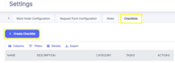
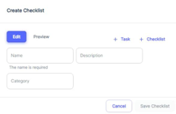
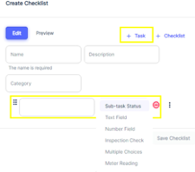
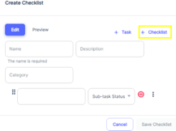
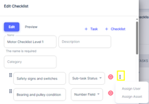
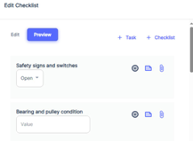
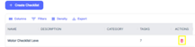

<!-- [!ref Lire l'introducution](./readme.md) -->
Checklists are powerful tools in ATLAS CMMS for standardizing processes, ensuring compliance, and driving consistent execution of maintenance tasks. The Checklist Setting allows you to create and manage these reusable task lists.
To access the Checklist Setting, navigate to `Settings > Checklists` from the main menu, as shown in the below image.

This will display the Checklist Management screen, listing any existing checklists.

### Creating a New Checklist
To create a new checklist, click the "+ Create Checklist" button in the top left. This will open the checklist creation form, as seen in the second image.

Here are the initial steps:
1.	Enter a descriptive "Name" for the new checklist in the provided field. This is a required step.
2.	Optionally, you can provide a "Description" with more details about the checklist's purpose.
3.	Select the appropriate "Category" from the dropdown to classify the checklist type (e.g. Safety, Preventive Maintenance, Quality Control).
Once you've specified the basic checklist details, you can start adding tasks to build out the actual checklist content.

### Adding Tasks to a Checklist
To add tasks or steps to the checklist, click the "+ Task" button, as highlighted in the third image.3 This will allow you to define the specific actions, inspections, or data points that need to be captured as part of the checklist.

Now, we will choose the method of how data will be collected. Our options are: 
- Sub-Task Status to give our step a status of open, in progress, on hold, or complete. 
- Text Field: Create a free-text or Alpha-Numeric field for technicians to enter notes, observations or other details.
- Number Field: Add a numeric field to capture measurements, counts or quantitative data points.
- Inspection Check: Include a simple pass/fail or flag check item.
- Multiple Choices: Define a list of multiple choice options for the technician to select from.
- Meter Reading: Meter Reading, which allows us to update one or multiple meters (which we will cover in a later section) from one or more work orders.

You can mix and match these task types within a single checklist to comprehensively document all required maintenance activities.
Once you save, you are now ready to apply your checklist to either a preventive maintenance trigger, or directly to a work order.

!!!ghost **Tip:**
Additionally, ATLAS provides the ability to nest checklists within each other. For example, you could create a parent "Monthly Inspection" checklist that includes a child "Lubrication Checks" sub-checklist, ensuring all lubrication points are properly inspected as part of the larger process.
!!!

### Assigning Users or Assets (Optional)
For certain tasks within the checklist, you may want to assign a specific user or asset for accountability.  To assign users or assets to specific Tasks, the user needs to click on the three vertical dots icon as shown above.

Clicking this icon reveals a small popup menu with two options - "Assign User" and "Assign Asset".

By selecting "Assign User", the user can assign that particular checklist task or sub-task to a specific user within the system.

Similarly, choosing "Assign Asset" allows the user to link that checklist item directly to an asset or piece of equipment tracked in the CMMS.

For instance, you could assign a "Lubrication" task to a specific technician skilled in that procedure, or link an "Engine Inspection" task directly to the associated engine asset. This helps streamline task routing and enables detailed reporting on asset history.

### Previewing the Checklist

Before finalizing and saving a new or edited checklist, ATLAS CMMS provides a convenient "Preview" feature to ensure the checklist looks and functions as intended.
As shown in the image, there is a blue "Preview" button located in the top-right corner of the checklist editing interface. 1Clicking this "Preview" button will open a new window or panel that displays a read-only preview version of the checklist you are working on. This allows you to review the checklist flow, task order, formatting, and overall presentation without making any further changes. The preview mode is particularly useful for:
- Verifying the checklist instructions are clear and easy to understand
- Ensuring all required tasks and sub-checklists are included in the proper sequence
- Checking that any conditional logic or branching is working correctly
- Confirming the visual layout and formatting meets your standards
During the preview, you can scroll through the entire checklist and even test out any interactions like expanding sections or selecting options from dropdown menus. However, no actual data input or changes can be made in this read-only preview mode.

If you notice any issues or have changes during the preview, simply close the preview window and you'll be returned to the checklist editing interface to make the necessary adjustments.

Once you have reviewed and confirmed the checklist looks correct in the preview, you can then click the "Save Checklist" button to commit your new or updated checklist.

The checklist can then be attached to work orders, preventive maintenance schedules, or used as a standalone process reference.

### Visualize or modify the details of an existing checklist
Additionally, to visualize or modify the details of an existing checklist, you can simply click on the checklist entry itself. This will open up the checklist in a view or edit mode, allowing you to see the individual tasks or steps within that checklist. If you want to modify the checklist, click "Edit" option once you have the checklist open, which will enable you to make changes to the tasks, descriptions, or other details of that particular checklist.

you can delete a pre-existing checklist by clicking on the red icon on the right side of each checklist entry.

By leveraging the Checklist Setting, you can drive standardization, ensure regulatory compliance, reduce human error, and improve overall quality and consistency of maintenance operations. The flexibility to customize checklist structures, tasks types, and assignments allows ATLAS to adapt to your organization's unique processes and requirements.