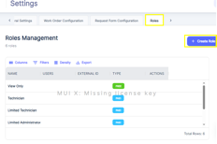
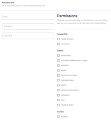

In addition to the pre-configured default roles like Admin, Technician, Requester etc., explained in previous chapter xxx, ATLAS CMMS provides a robust roles management system that allows administrators to define and customize user roles according to their organization's specific requirements. The Roles Management screen, accessible from Settings > Roles, displays all currently configured roles within the system.

As shown in the image, the default roles like Admin, Technician, Limited Technician, Limited Administrator, and Requester are pre-configured. However, ATLAS offers the flexibility to create additional customized roles tailored to your needs. To create a new role, click on the "+Create Role" button in the top right corner of the Roles Management screen. This will open a form where you can specify the new role's details.

1.	Enter a descriptive "Name" for the new role you want to create.
2.	Under "Permissions", you can selectively enable or disable access to various CMMS modules and capabilities for this role. This granular control allows you to construct highly specialized roles.
For example, you could create a "Maintenance Planner" role with permissions to create work orders, view/edit the preventive maintenance program, manage assets, but restrict access to financial reports.
Another example: you could create a "Reliability Engineer" role with permissions to analyze system reliability, participate in maintenance planning, and access failure analysis reports, but restrict their ability to create or modify work orders.

By leveraging the customized roles functionality, you can implement role-based access control (RBAC) that aligns with your team's responsibilities, compliance requirements, and maintenance processes. This ensures each user has just the right level of system access to be productive while maintaining proper controls and segregation of duties.