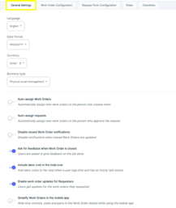

## General Settings

1.	Language Selection
The Admin can choose the default language for the ATLAS CMMS interface from the "Language" dropdown. This setting allows the system to be configured for users who speak different languages, promoting accessibility and ease of use.
2.	Date and Currency Formats
Under "Date format" and "Currency", the Admin can set the preferred formatting for displaying dates and currency values throughout the CMMS application. Ensuring these formats align with organizational or regional standards is important for consistent data entry and reporting.
3.	Business Type Configuration
The "Business type" dropdown allows the Admin to specify the nature of the organization's operations, such as "Physical asset management", "Facilities management", etc. This setting tailors certain CMMS features and workflows to better fit the selected business context.
4.	Work Order Assignment Rules
The Admin can configure rules for automatically assigning new work orders by checking the relevant options:
    - `Auto-assign Work Orders` to the creator
    - `Auto-assign requests` to the approver
5.	Notification Settings
The Admin has control over notifications related to work orders, such as disabling notifications for closed work orders or prompting for feedback when orders are closed. These settings impact communication and data collection workflows.
6.	Cost Tracking Configuration
The Admin can enable options to "Include labor cost in the total cost" and "Enable work order updates for Requesters". These settings allow for comprehensive cost tracking and visibility into work order updates for relevant stakeholders.
7.	Mobile App Settings
The "Simplify Work Orders in the mobile app" option gives the Admin control over the level of detail displayed for work orders in the mobile app, allowing optimization for field technician needs.
By walking through these general settings, the Admin can tailor the initial ATLAS CMMS configuration to align with the organization's processes, preferences, and unique requirements right from the start.