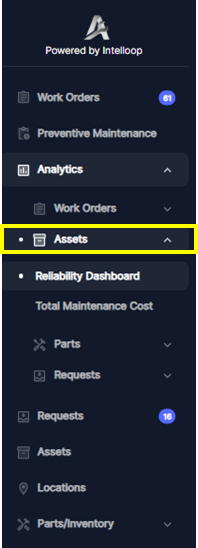

Let's explore the **Asset Dashboard** within the specified period of time chosen by the user, focusing on the two sub-dashboards: ***Reliability Dashboard*** and ***Total Maintenance Cost***.

Access the `Analytics`section from the main navigation menu and Click **Assets*.

The Reliability Dashboard provides insights into the performance and availability of assets within a specified date range. This dashboard is crucial for monitoring and analyzing asset reliability, identifying potential issues, and optimizing maintenance strategies.

##### Downtime and Availability
- ***Total Downtime (hours)***: represents the cumulative downtime, in hours, for all assets within the specified date range.
- ***Availability percentage***: indicates the percentage of time the assets were in an operational state within the specified date range.
- ***Downtime Events***: shows the total number of downtime events or instances that occurred during the selected date range.

The `Downtime and Availability` section provides a high-level overview of asset performance, highlighting the total downtime, availability percentage, and the frequency of downtime events. This information is valuable for assessing the overall reliability of the assets and identifying potential areas for improvement.

##### Repair Time By Asset(MTTR)
This bar chart displays the repair time for each asset within the specified date range. The bars represent the mean time to repair (MTTR) in hours, which means the Average age of complete work orders by assets, while the line plot shows the total repair time for each asset. This visualization allows maintenance teams to identify assets that require excessive repair time, which may indicate the need for preventive maintenance, equipment upgrades, re-training or process improvements.

##### Downtime By Asset
This bar chart illustrates the downtime duration for each asset within the specified date range. The bars represent the total downtime in hours, while the line plot shows the downtime as a percentage of the total operational time within the specified date range. By analyzing this chart, maintenance teams can pinpoint assets with significant downtime, enabling them to prioritize maintenance efforts and implement strategies to minimize downtime and improve asset availability.

##### Downtimes Trends
The line graph titled "Downtimes Trends" displays the mean time between failures (MTBF) over a broader time range, typically spanning multiple months or years, which is the average time between all successive failures or downtimes within the specified period. This visualization helps identify patterns or trends in asset reliability, such as seasonal variations or the impact of maintenance initiatives.

By leveraging the Reliability Dashboard, organizations can gain valuable insights into asset performance, downtime, and availability. This information can be used to optimize maintenance strategies, prioritize asset replacements or upgrades, and ultimately improve overall operational efficiency and productivity.