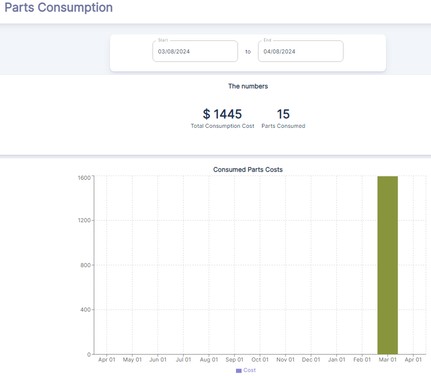

---

label: Overview Of Parts Consumption
order: 30
---

The Parts Consumption Dashboard is an essential tool within a CMMS for tracking and analyzing the usage and costs associated with spare parts and materials over a specified period. This dashboard offers a clear view of parts expenditure and can help in inventory management and cost control.

##### Overview of Parts Consumption
- ***Total Consumption Cost***: $1445 indicates the total cost of parts that have been consumed within the selected date range.
- ***Parts Consumed***: 15 represents the total number of individual parts that have been used in maintenance activities during this period.
