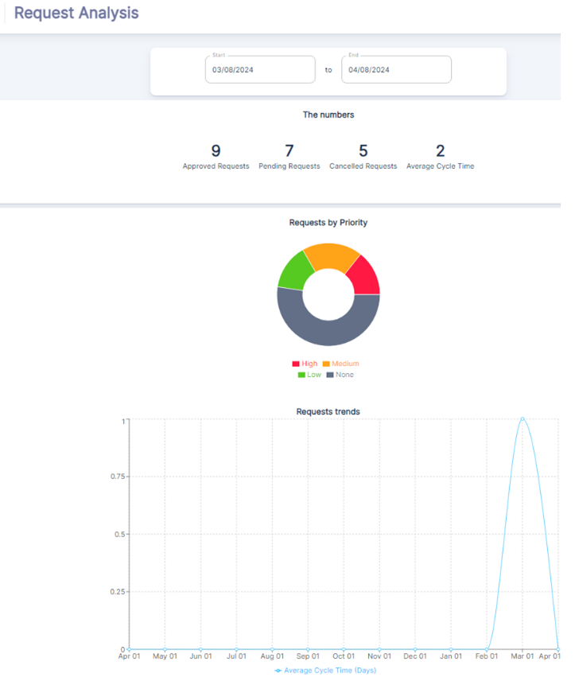

The Request Analysis Dashboard is a vital component of the Assets Dashboard, designed to provide a comprehensive overview of work request activities within a CMMS. This dashboard allows users to monitor the status and progression of work requests over a specified period, offering actionable insights for improving service delivery and response times.

##### Key Metrics Summary
- ***Approved Requests***: The number of requests that have been reviewed and authorized for action.
- ***Pending Requests***: Requests that are currently awaiting review or action.
- ***Cancelled Requests***: Requests that have been withdrawn or deemed unnecessary.
- ***Average Cycle Time***: The average duration from the creation of a request to its completion or approval.