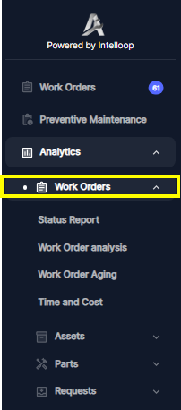
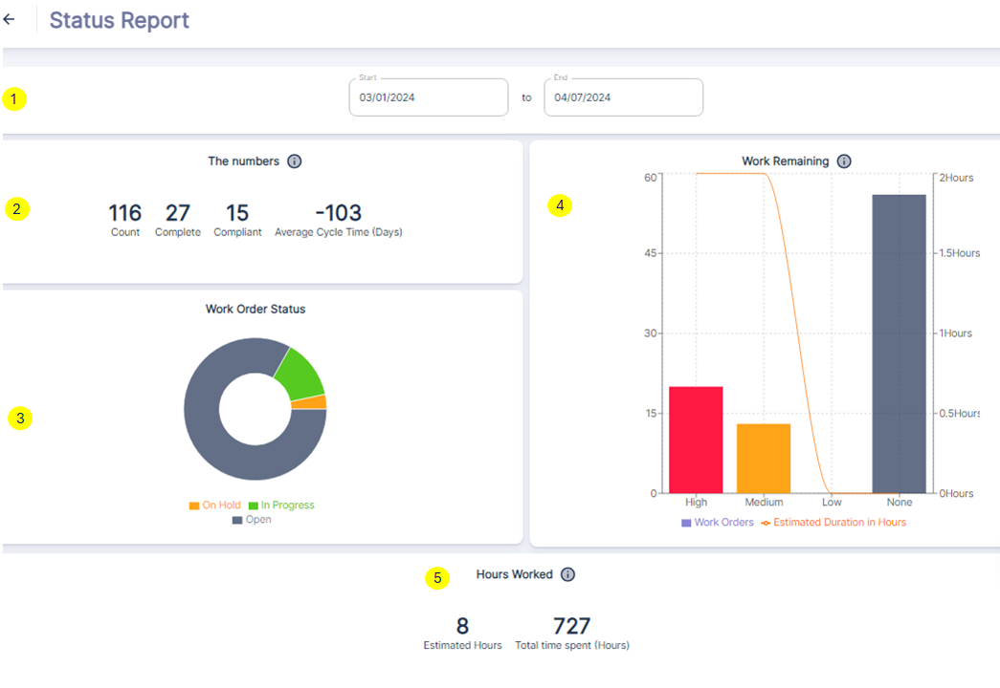
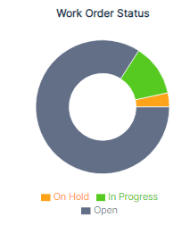
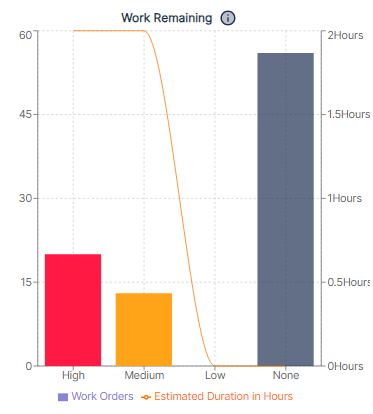
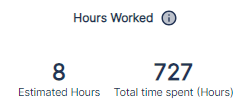

Atlas CMMS analytics provide valuable insights into the performance, efficiency, and costs associated with maintenance operations. This chapter will guide you through the various analytics available in the CMMS and how to interpret them to drive actionable improvements.

**Important**: Many of the metrics, statistics, and data points presented will be relative to and dependent on the selected time frame.

The values associated with these KPIs will vary based on the date range chosen by the user at the top of the dashboard.

##### Work Orders
Access the `Analytics` section from the main navigation menu and Click `Work Orders`.

The `Status Report` dashboard provides a high-level overview of work order performance and status within the company for a selected date range. **①**

Let's break down each component:

The Numbers **②**
- ***Count***: represents the total number of work orders within the specified date range.
- ***Complete***: indicates the number of work orders that have been marked as Completed.
- ***Compliant***: shows the number of work orders that were completed before their due date, which are considered compliant.
- ***Average Cycle Time***: displays the average time it took to complete a work order, from creation to completion.

Work Order Status **③**

The pie chart visualizes the current status of open work orders within the date range:

- ***On Hold***: Work orders that have been temporarily paused or put on hold.
- ***In Progress***: Work orders that are currently being worked on by technicians.
- ***Open***: Work orders that have been created but work has not yet started.

Work Remaining **④**

This bar graph shows the remaining incomplete work orders, categorized by priority:

- ***High***: Number of high-priority incomplete work orders due within the date range.
- ***Medium***: Number of medium-priority incomplete work orders due.
- ***Low***: Number of low-priority incomplete work orders due.
- ***None***: Number of incomplete work orders with no assigned priority due.

The line plot overlaid on the bars represents the estimated duration in hours for completing each category of remaining work orders.

Hours Worked⑤

This section provides insights into the actual time spent on work orders due within the date range:

- Estimated Hours: represents the total estimated hours for all work orders due.
- Total time spent: shows the cumulative number of hours worked on those work orders so far.

### Case Study of how to leverage this `Status Report` dashboard effectively

#### Monitor Work Order Performance:

- Analyze the `Work Order Status` pie chart to understand the distribution of open, in-progress, and on-hold work orders during the selected date range. Example If the "On Hold" slice in the "Work Order Status" pie chart is disproportionately large, it may indicate a bottleneck in the maintenance process, requiring further investigation.
- Use the `Work Remaining` bar graph to identify the number of incomplete work orders categorized by priority (high, medium, low), allowing for better resource allocation and prioritization. Example: A high number of "High" priority work orders in the "Work Remaining" section could signal a need for additional resources or a review of the prioritization process.
- Track the `Average Cycle Time` metric to assess the efficiency of work order completion and identify opportunities for process improvement. Example: An unusually high "Average Cycle Time" compared to historical data or industry benchmarks may suggest inefficiencies in the work order lifecycle that need to be addressed.
- Compare the `Estimated Hours` against the "Total time spent" to evaluate labor utilization and productivity for work orders within the specified period.
Facilitate Data-Driven Decision Making:
    -Use the dashboard to set realistic, evolutive targets or goals for metrics like "Compliant" work orders (completed before the due date) or "Average Cycle Time" reduction.
    -Analyze trends over time by adjusting the date range filter to identify patterns, seasonality, or areas requiring focused improvement efforts.
- Communicate Performance and Align Teams:
    -Use the visualizations to facilitate discussions, highlight achievements, and align teams around common goals and performance metrics.
    -Leverage the dashboard during team meetings or performance reviews to celebrate successes, address challenges, and collaboratively develop improvement strategies.

By leveraging this `Status Report` dashboard effectively, organizations can gain valuable insights into their maintenance operations, make data-driven decisions, identify areas for optimization, and ultimately improve overall efficiency, productivity, and asset reliability.