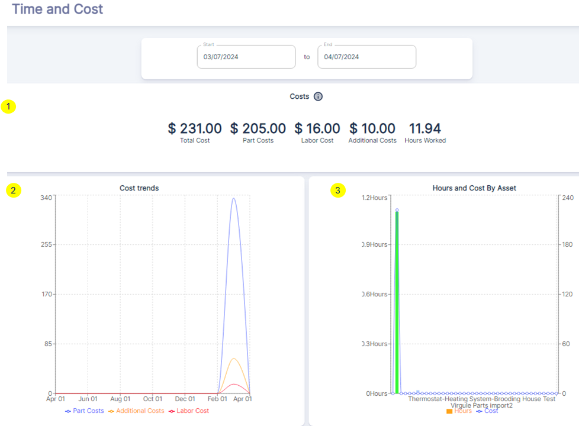

---

label: Time And Cost Dashboard
order: 10
---

The `Time and Cost Dashboard` under the `Work Orders Dashboard` provides a detailed view of the financial and temporal aspects of work order management. Let's break down each part of the dashboard:

##### Overview of Time and Cost Metrics
1. ***Total Cost***: represents the cumulative cost of all work orders completed within the specified time frame, which includes labor, parts, and additional costs.
2. ***Part Costs***: indicates the total cost of parts used in the work orders.
3. ***Labor Cost***: shows the total labor cost associated with the work orders.
4. ***Additional Costs***: accounts for any other costs incurred during the work order completion, such as contractor fees, emergency fees or expedited shipping…
5. ***Hours Worked***: represents the total number of hours worked on the work orders.

##### Cost Trends
The `Cost trends` line graph provides a visual representation of how part costs, additional costs, and labor costs have fluctuated over time. This graph can help identify patterns or anomalies in spending, such as unexpected spikes in part costs or labor, which could indicate a need for process improvement or renegotiation with suppliers.

##### Hours and Cost By Asset
The `Hours and Cost By Asset` bar graph breaks down the hours worked and costs by individual assets. This allows for a granular analysis of which assets are consuming the most resources and may require further investigation or preventive maintenance to reduce future costs.

##### Leveraging Time and Cost Dashboard
- ***Budgeting and Forecasting***: Use the total cost data to refine budgeting for future periods and forecast expected expenses based on historical trends.
- ***Cost Control***: Analyze the "Cost trends" graph to identify and investigate any irregularities or cost overruns, enabling proactive measures to control expenses.
- ***Resource Allocation***: Review the **Hours Worked** metric to assess if labor is being utilized efficiently and make adjustments to staffing or scheduling as needed.
- ***Asset Management***: Utilize the `Hours and Cost By Asset` graph to determine which assets are the most cost-intensive and may benefit from targeted maintenance strategies or replacement.
- ***Performance Analysis***: Compare the costs and hours worked across different assets or time periods to evaluate the effectiveness of maintenance practices and identify areas for improvement.

By effectively leveraging the "Time and Cost Dashboard" under organizations can gain insights into the financial and time-related dimensions of their work orders, enabling them to optimize maintenance operations, reduce costs, and improve overall efficiency.