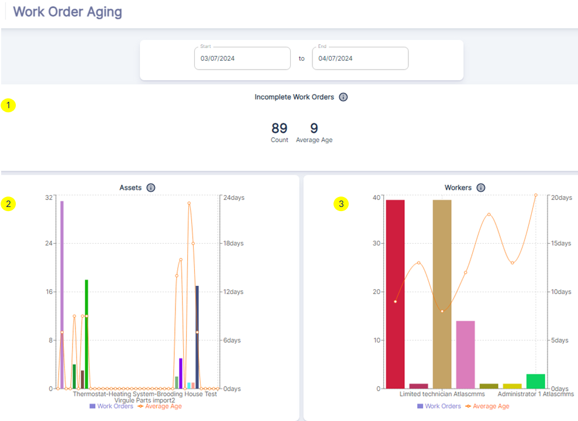

---

label: Work Order Aging Dashboard
order: 20
---

Work order age is defined as the Time between the creation of the work order (or work request) and the current date.

`Incomplete Work Orders`**①**

This section provides a snapshot of the current state of incomplete work orders. The ***Count*** represents the total number of work orders that have not yet been completed as of the selected date range.
The "Average Age" indicates the average time that these incomplete work orders have been open.

`Assets`**②**

The bar graph under **Assets** breaks down the age of work orders associated with specific assets. Each bar represents a different asset, and the height indicates the number of open work orders for that asset.

- The line graph overlay shows the average age of work orders for each asset, giving a visual representation of which assets may have work orders that are overdue or have been open for an extended period.

`Workers`**③**
Similar to the **Assets** section, the **Workers** bar graph displays the number of open work orders assigned to each worker or technician.

- The line graph indicates the average age of work orders per worker, which can help identify if certain workers have a backlog of work orders that need attention.

##### Leveraging the `Work Order Aging` Dashboard:
1. ***Prioritize Overdue Work Orders***: By reviewing the `Incomplete Work Orders` section, maintenance managers can prioritize work orders that have been open for too long, potentially reallocating resources to address these first.
2. ***Asset Maintenance Scheduling***: The `Assets` section allows managers to identify which assets have the oldest work orders, suggesting a need for more proactive maintenance scheduling or a review of asset performance.
3. ***Workforce Management***: The `Workers` section can highlight which technicians have high work order averages, indicating a need for workload rebalancing or additional support to clear the backlog.
4. ***Performance Analysis***: By analyzing the average age of work orders across assets and workers, managers can assess the efficiency of their maintenance processes and identify areas for improvement.
5. ***Strategic Planning***: The dashboard data can inform strategic decisions, such as hiring additional staff, investing in training, or adjusting maintenance strategies to prevent work order aging.

By utilizing the insights provided by the `Work Order Aging` dashboard, maintenance teams can take proactive steps to ensure work orders are completed in a timely manner, ultimately improving asset reliability and maintenance service levels.