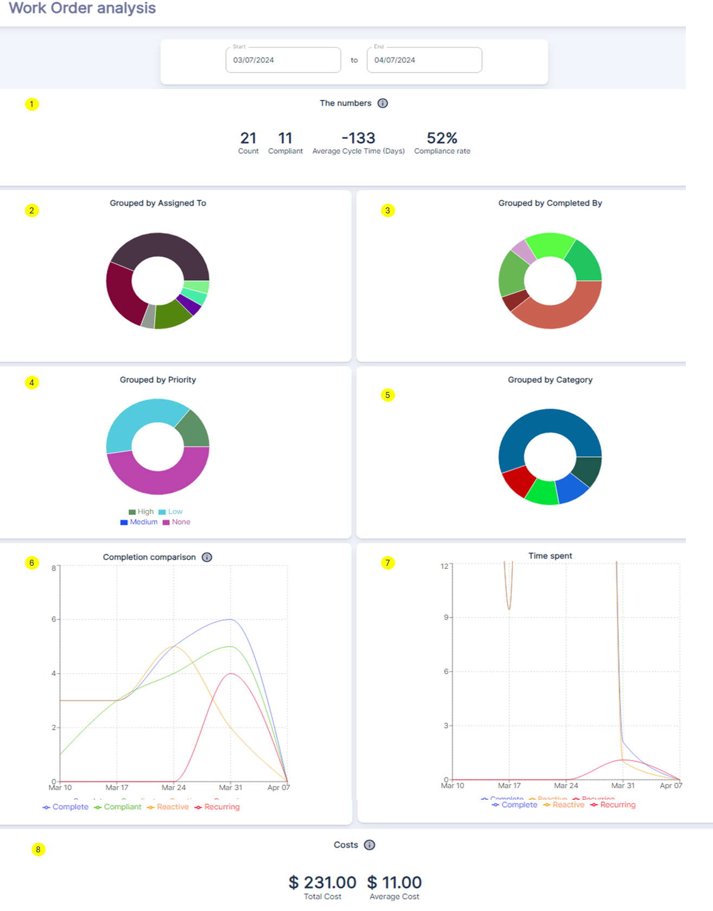

The `Work Order Analysis` dashboard provides an in-depth analysis of work order performance, categorized by various factors such as assigned personnel, priority levels, and work order types. This dashboard enables maintenance teams to identify areas for improvement and optimize their operations within the selected date range.

`The Numbers` **①**
- ***Count***: represents the total number of work orders during this period.
- ***Compliant***: indicates the number of work orders that were completed before their due date, considered compliant.
- ***Average Cycle Time***: displays the average number of days it took to complete a work order from creation to completion.
- ***Compliance Rate***: shows the percentage of work orders completed compliantly (before the due date).

`Grouped by Assigned To / Completed By` **②③**

These donut charts provide a breakdown of work orders based on the assigned technicians and the individuals who completed the work orders, respectively. This information helps identify potential bottlenecks, workload imbalances, or training needs among the team.

`Grouped by Priority / Category` **④⑤**

The donut charts categorize work orders based on their assigned priority levels (High, Low, Medium) and types such as Reactive (emergency maintenance after equipment failure), Recurring (preventive or scheduled maintenance), and others. This data assists in prioritizing resources and optimizing maintenance strategies.

`Completion Comparison`**⑥**

This line chart compares the completion trends of various work order types like Complete, Compliant, Reactive, and Recurring over the selected date range. The different colored lines represent each type, helping identify patterns, seasonality, or spikes in specific areas.

`Time Spent` **⑦**

This graph displays the total time spent on work orders during the period. The y-axis represents time, while the x-axis shows dates. This information analyzes labor utilization and identifies periods of high or low workload for resource optimization.

`Costs`**⑧**
- `Total Cost`: represents the cumulative cost of all work orders, including labor, additional expenses, and parts.
- `Average Cost`: shows the average cost per work order during this period.

##### Case Study of how to leverage this `WO Analysis Dashboard` dashboard effectively
1. Monitor Work Order Volumes and Trends:
- Analyze the `Grouped by Category` donut chart to understand the distribution of work orders across different categories (e.g., **Reactive**, **Preventive**, **Corrective**).
- Use the `Completion Comparison` line chart to identify patterns, seasonality, or spikes in the completion of various work order types over time.
- Track the `Time Spent` graph to assess labor utilization and identify periods of high or low workload, enabling better resource allocation and planning.
2. Identify Bottlenecks and Inefficiencies:
- If the `Grouped by Assigned To` or `Grouped by Completed By` donut charts show an imbalance, it may indicate workload distribution issues or potential bottlenecks with specific technicians or teams.
- A high volume of `Reactive` work orders in the `Grouped by Category` chart could signal the need for more proactive maintenance strategies or root cause analysis to reduce equipment failures.
- Unusually long cycle times or a high number of non-compliant work orders (based on ***The Numbers*** section) may point to process inefficiencies that need to be addressed.
3. Optimize Resource Allocation and Prioritization:
- Use the `Grouped by Priority` donut chart to assess the distribution of work orders across different priority levels (High, Medium, Low).
- Combine this information with the `Completion Comparison` and `Time Spent` data to ensure that high-priority work orders are receiving adequate attention and resources.
- Adjust resource allocation or implement process improvements to reduce the cycle time for high-priority work orders and improve compliance rates.
4. Facilitate Data-Driven Decision Making:
- Analyze trends over time by adjusting the date range filter to identify patterns, seasonality, or areas requiring focused improvement efforts:
- ***Maintenance Strategy Evaluation***: A decreasing trend in the **New** work orders over the last 90 days could suggest that preventive maintenance strategies are effective, leading to fewer unexpected repairs.
- ***Performance Review***: An increasing trend in `Completed work orders over time` could indicate improved team efficiency or the successful implementation of new tools or processes.
- ***Planning and Forecasting***: By analyzing the bar chart, managers can forecast future work order volumes and plan for necessary staffing, training, or inventory procurement.
- ***Process Improvement***: If the line graph shows extended completion times for work orders, it may highlight areas where the maintenance process could be streamlined or where additional training might be needed.

By leveraging this dashboard, maintenance teams gain valuable insights into work order performance based on assigned personnel, priorities, types, completion trends, time spent, and associated costs. This comprehensive analysis enables data-driven decisions to optimize maintenance operations continuously.