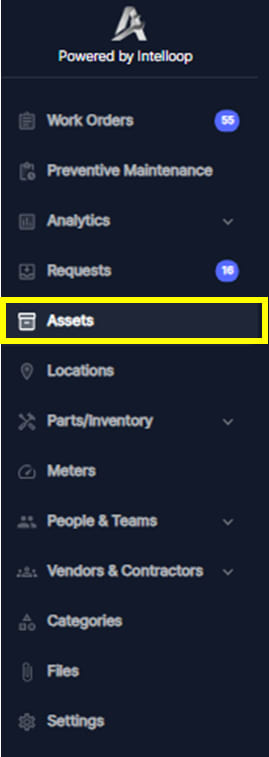

1. From the left sidebar menu, locate and click on the "Assets" option to access the Assets Record module

1. This will open the Assets view, displaying a list of existing Assets organized in a table format showing  Parent Asset’ Status, Location, Image, Description, Barcode…
