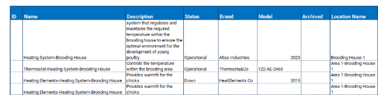
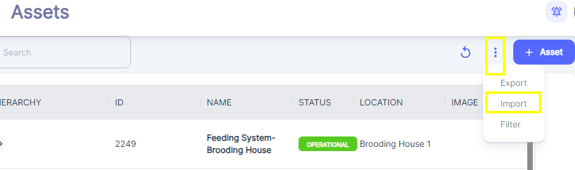
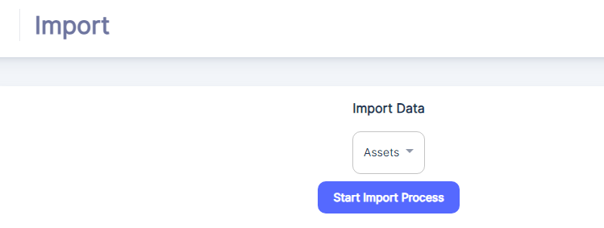
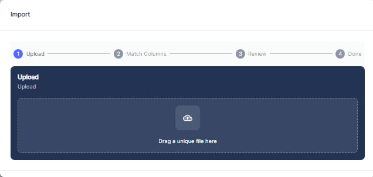
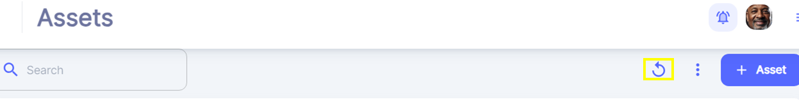

---

label: Importing From A Template
order: 9
---
Download the Assets template from the Atlas CMMS website under ["Import Templates".](https://atlascmms.com/app/imports/work-orders)

Fill out the template with your Assets details, ensuring parent Assets are listed before child Assets.

In the CMMS application, click the three vertical dots on the right side and select "Import".

Then:

Then Click: “Start Import Process”

Either drag and drop the filled template file or select it from your device.

Follow the prompts to complete the import process successfully.

After importing, click the refresh button near the three vertical dots to view the imported Assets.

__Note 1__: It is crucial to start with parent Assets before listing child Assets when filling out the template. This is because the CMMS system relies on a hierarchical structure to organize and manage Assets effectively.

By defining parent Assets first, you establish the top\-level Asset in the hierarchy. Child Assets can then be nested under their respective parent Assets, reflecting the real\-world relationships and dependencies between different Assets.

Maintaining this hierarchical structure ensures proper data organization, enables efficient navigation and filtering of Assets, and supports accurate reporting and analysis based on Assets hierarchies. It also allows for easier maintenance and updates, as changes to a parent Asset can be propagated to its child Asset as needed.

__Note 2__: the "Archived" column when importing assets into  Atlas CMMS indicates whether the asset being imported is currently active and in use, or if it has been archived or decommissioned. Specifically:

- Assets marked as "Archived = Yes" are assets that are no longer actively used or maintained. They have been archived or removed from the active inventory, and will not impact KPIs calculations but are still retained in the system for historical records or reference purposes.
- Assets marked as "Archived = No" or Empty are assets that are currently active and in operational use within the organization.

Some key points about the "Archived" column when importing assets:

- It helps maintain an organized and up\-to\-date view of the active asset inventory, separating it from archived/legacy assets.
- Archived assets can still be accessed for reporting, auditing, or analyzing historical asset data and maintenance records.
- This column allows for better data management, preventing the active asset list from becoming cluttered with outdated or decommissioned equipment.
