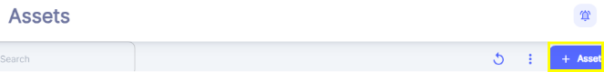
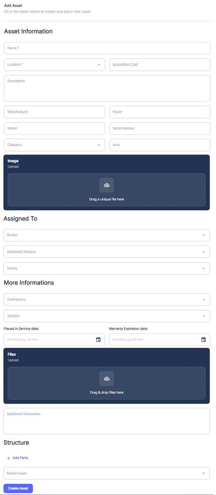

In the

Go to “Assets” Menu, click the "\+ Asset" button at the top right corner of the screen.

A new window will open to enter details for the new Asset.

Fill in required fields like Asset name, address, and any other relevant information.

If applicable, specify the parent Asset to establish a hierarchical relationship.

During Asset creation, we can also assign workers, teams, vendors, and contractors to specific Assets. Additionally, you have the option to attach pictures directly from your mobile camera or by dragging and dropping image files. Furthermore, you can attach relevant files to a location, such as floor plans, site maps, equipment manuals, or safety documents, which can provide valuable context and information for that particular location.

Note 1: Assigning workers, teams, vendors, and contractors to locations is beneficial for several reasons:

- It helps establish clear responsibilities and accountability for maintenance tasks at each location.
- It enables efficient work order assignment and resource allocation based on location.
- It supports location\-specific reporting and analysis of maintenance activities.
- Attaching pictures can be useful for visually documenting the layout, equipment, or specific areas of a location, aiding in better understanding and communication.

Once all necessary details are provided, click "Save" or "Create" to add the new location.
