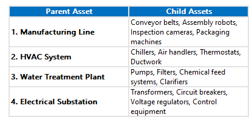

---

label: Definition
order: 1
---
Assets are the physical resources or equipment that an organization owns and utilizes to carry out its operations. In the context of a CMMS, assets refer to the machinery, equipment, vehicles, buildings, and other tangible items that require maintenance, repair, and tracking.

Accurate data entry and a well\-defined hierarchy are essential for effective asset management within a CMMS. A correct data hierarchy allows for easy organization, categorization, and retrieval of asset information, enabling efficient maintenance planning, resource allocation, and decision\-making.
