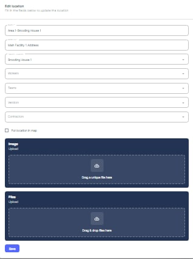

---

label: Modifying Existing Assets Details
order: 6
---
1. To modify the details of an existing location, locate the desired location in the list.
2. Click on the respective row or the edit icon \(pencil symbol\) in the "Actions" column.
3. This will open the "Edit Location" form, where you can update various fields such as the location name, address, contact information, and any other relevant details.

4. After making the necessary changes, click "Save" to apply the modifications to the selected location.

Next, we will explore how to record your Parts details within ATLAS CMMS.
