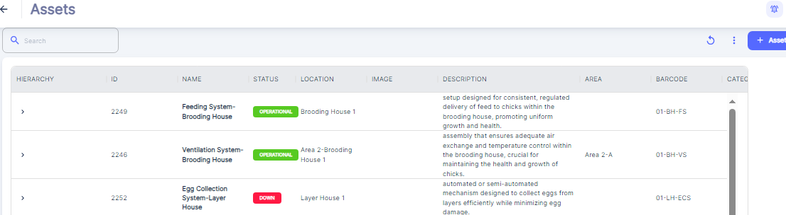
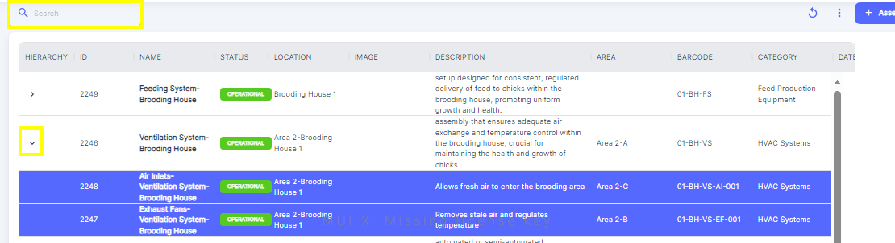

---

label: Viewing Assets
order: 8
---

1. The table shows a "Hierarchy" column with small arrows next to some Assets names.
2. Click on the arrow icon to expand and view any Child Assets \( or Sub\-Asset Machine sub\*system, \) nested under a parent Asset
3. This hierarchical structure allows you to see the relationship between different Assets within your organization.

You can as well Search Asset by Taping Asset name in search area.

