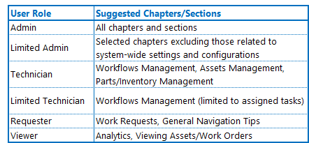

---

label: Training Matrix
order: 1000
---
Atlas CMMS Training Matrix is designed to guide different user roles through the specific chapters or paragraphs of the Atlas User Guide that are most relevant to their responsibilities and access levels. The matrix below outlines suggested chapters and sections for each default user role:

__Customizing the Training Matrix:__

The Admin has the flexibility to customize user roles and the associated training matrix to fit the unique needs of their organization. By navigating to the "Roles Setting" section within the CMMS, the Admin can define new roles with specific permissions and responsibilities. Once these custom roles are established, the Admin can then adjust the training matrix to direct users to the most relevant chapters and sections based on their customized roles.

For example, if a new role such as "Maintenance Planner" is created, the Admin can update the training matrix to include chapters on "Preventive Maintenance," "Work Order Scheduling," and "Analytics" for users assigned to this role.

It is important for the Admin to review and update the training matrix regularly, especially after making changes to user roles or system functionalities, to ensure that all users have the guidance they need to effectively use Atlas CMMS.

__Training Matrix Implementation__

- __Reference Material__: Use the matrix as a reference tool for users to quickly identify which sections of the guide they should consult for help or to learn new features related to their role.
- __Onboarding New Users__: Incorporate the training matrix into the onboarding process for new users. This helps them understand which parts of the user guide are most relevant to their role from the start.
- __Continuous Learning__: Encourage users to consult the matrix and the corresponding sections of the user guide as part of continuous learning and when new features are introduced to the CMMS.
- __Customized Training Sessions__: Based on the matrix, organize training sessions tailored to each user role. This ensures that users receive the most relevant information for their specific duties within the CMMS.

