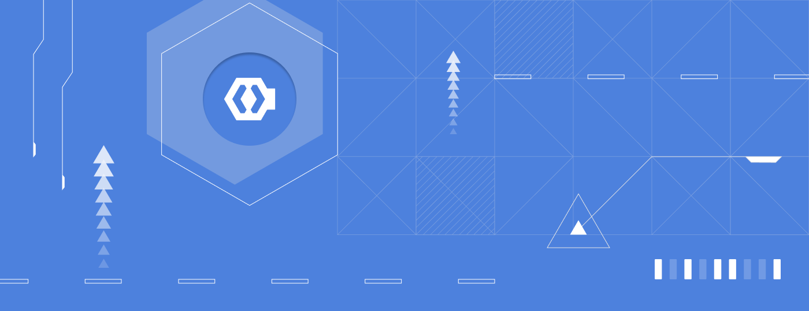

Congratulations on completing the ATLAS CMMS user guide! You now have the knowledge and skills to fully leverage Africa's premier maintenance management system.Let's recap some of the key points:

- ATLAS provides a centralized platform to efficiently manage all your assets, work orders, materials, and maintenance data
- The system is organized around key user roles like admins, technicians, and requesters to provide the right capabilities to each team member
- Powerful features like preventive maintenance, mobile access, analytics, and integrations enable more proactive and data-driven maintenance
- Achieving success requires not just software, but also following maintenance best practices and building a culture of continuous improvement

With ATLAS, you have a strong digital foundation to support your maintenance excellence journey. But technology is just one part of the equation. To realize the full benefits, make sure to:
- Engage your team in the ATLAS rollout and get their input on processes
- Invest in training and change management to drive system adoption
- Establish KPIs and governance to measure and sustain progress
- Continuously capture lessons learned and implement improvements

ATLAS is here to support you every step of the way as your maintenance program advances. Be sure to take advantage of our online help resources, customer community, and expert consulting services to overcome any obstacles.We appreciate you choosing ATLAS CMMS and look forward to partnering on your maintenance success. Here's to a future of high reliability, safety, and productivity powered by ATLAS!
