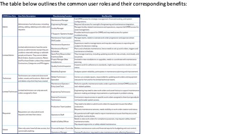

<!-- !!!ghost Fichier à joindre
[!file Télécharger](../static/docs/)
!!! -->

## General Overview
The ATLAS CMMS provides capabilities tailored to different user roles within an organization's maintenance operations. Understanding the specific benefits each role can derive from the system is crucial for effective adoption and maximizing the value of the software. The table below outlines the common user roles and their corresponding benefits:

This table highlights the diverse range of stakeholders involved in maintenance operations and how a CMMS like ATLAS can benefit each role by providing relevant access, capabilities, and insights. By understanding these role-based benefits, organizations can better engage their teams, streamline processes, and unlock the full potential of their CMMS investment.
In addition to the pre-configured default roles like Admin, Technician, Requester etc., ATLAS CMMS provides administrators with the flexibility to create customized roles tailored to their organization's specific needs. (See Chapter xxx)

<!-- 
## General Overview

## Admin Guide

### Initial Setup and Configuration
#### General Settings

### Work Orders (WO) Setting
#### WO Creation Settings
#### Completing Work Orders Settings

### Customized Roles

### Checklist Setting
#### Adding Tasks to a Checklist
##### Assigning Users or Assets (Optional)
##### Previewing the Checklist
##### Visualize or modify the details of an existing checklist

### Categories Configuration
#### Work Order Categories
#### Asset Categories
#### Meter Categories
#### Timer Categories
#### Cost Categories
#### Parts Categories
#### Add a new category

## Poeple and Teams configuration
### People configuraton
### Teams configuration

## Locations Record
### Accessing Location Details
### Viewing Location Hierarchy
### New Location Creation
### Manual Creation
### Importing from a Template
### Modify Existing Locations

## Assets Record
### Introduction to Assets
### Accessing Assets Details
### Viewing Assets Hierarchy
### New Asset Creation
### Manual Creation
### Importing from a Template

## Password Reset

## Conclusion

 -->
