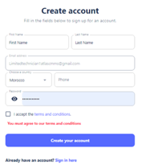
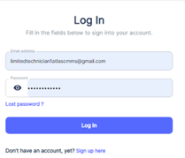

[!ref Lire l'introducution](./readme.md)

## Subscription Process

The process for subscribing to `ATLAS CMMS` depends on whether your company is already using the system or if this is the first implementation.

### Case 1: Company Already Using ATLAS CMMS

If your organization has an existing ATLAS CMMS account, the subscription process will involve the admin assigning you a user role and permissions. Here are the steps:
1. The admin will add you to the "People & Teams" module, assigning you a specific user role like Technician, Manager, etc.
2. You will receive an email invitation from "admin@atlascmms.com" with the subject "Invitation to use Atlas CMMS".
3. Open the email, which will look like this:

The email contains an "Invitation to use Atlas CMMS" message stating that you have been invited to join the company's team on Atlas with your assigned role. There is a green "Join Company" button to accept the invitation.
4.	Click the "Join Company" button in the email.
5.	This will open a "Create account" form in your web browser, which looks like:

6.	Fill out the "Create account" form with your details like First Name, Last Name, Email, Country, Phone, and choose a secure Password.
7.	Check the box to accept the terms and conditions.
8.	Click the "Create your account" button to submit the form.
9.	Your ATLAS CMMS account is now created and you can log in using your email/password to start using the software based on your assigned role permissions. By Login through Atlas Landing page Login Button

### Case 2: First-Time ATLAS Implementation
1.	If this is your company's first time using ATLAS CMMS, the initial subscription will start with creating an organizational account. Follow these steps: 
Go to the ATLAS CMMS website or application.
2.	You will see a login page similar to the one shown in Image 1. Click on the "Sign up here" or "Create account" link/button.
3.	This will take you to the "Create account" form as seen in Images 6 and 7.
4.	In the "Create account" form, fill in the required fields:
    - First Name
    - Last Name
    - Email address (this is a required field, highlighted in red in Image 7)
    - Choose a country from the dropdown
    - Enter your phone number
    - Create a secure password (this is also a required field, highlighted in red in Image 7)
5.	Additionally, you may need to provide:
    - Company Name
    - Number of Employees
6.	Review and accept the terms and conditions by checking the box (as shown in Image 7).
7.	Once all required fields are filled, click the "Create your account" button to submit the form.
8.	After successful account creation, you will be able to access the ATLAS CMMS system as an admin user.
9.	From the admin account, you can start configuring the system, as we will see in next chapter, by:
    a)	Adding other user accounts and assigning roles
    b)	Setting up locations, equipment, and asset hierarchies
    c)	Defining maintenance workflows and schedules
    d)	Customizing system settings and preferences
This process establishes your company's presence within the ATLAS CMMS platform for the first time. As the initial admin user, you have full control to set up the system according to your organization's needs before rolling it out to other users like technicians, managers, and requesters.

Whether joining an existing implementation or starting new, ATLAS provides a straightforward subscription process to get your maintenance team up and running quickly on the software
