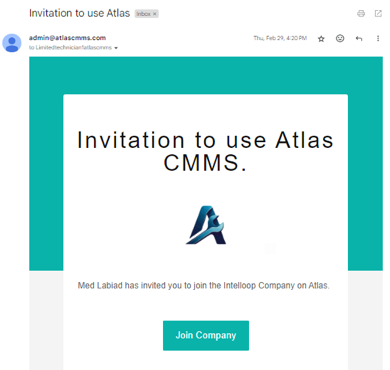

[!ref Lire l'introducution](./readme.md)

## Subscription Process

The process for subscribing to `ATLAS CMMS` depends on whether your company is already using the system or if this is the first implementation.

### Case 1: Company Already Using ATLAS CMMS

If your organization has an existing ATLAS CMMS account, the subscription process will involve the admin assigning you a user role and permissions. Here are the steps:
1. The admin will add you to the "People & Teams" module, assigning you a specific user role like Technician, Manager, etc.
2. You will receive an email invitation from "admin@atlascmms.com" with the subject "Invitation to use Atlas CMMS".
3. Open the email, which will look like this:

