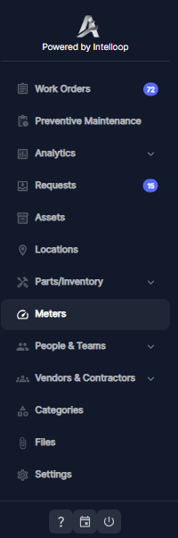
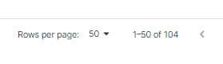
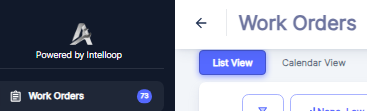

### Using the Main Menu

The main menu in the Atlas CMMS application provides quick access to all the major features and functionalities. It is designed to be intuitive and user\-friendly, allowing you to navigate seamlessly between different areas of the application.

Accessing the Main Menu

The main menu is prominently displayed on the left side of the application interface. It is available from any screen within the application, ensuring easy access to all the available options.

Menu Structure

The main menu is organized into several sections, each containing related menu items. The sections are:

- Work Management \(Work Orders, Preventive Maintenance, Requests\)
- Asset Management \(Assets, Locations, Parts/Inventory, Meters\)
- Analytics and Reporting \(Analytics\)
- Administration \(People & Teams, Vendors & Contractors, Categories, Files, Settings\)

Navigating the Menu

To access a specific area of the application, simply click or tap on the corresponding menu item. For example, to access the Work Orders section, click or tap on the "Work Orders" menu item.If a menu item has a dropdown arrow next to it, it indicates the presence of additional sub\-menu items. Click or tap on the main menu item to expand the sub\-menu, and then select the desired sub\-menu item.

For each Menu item opened, and at the bottom right, the interface provides users with the ability to control the number of product rows displayed per page. A dropdown menu labeled "Rows per page" offers several options, up to 50 rows per page. By selecting a different value from this dropdown, users can adjust the density of the product grid, displaying more or fewer items simultaneously

### Returning to the Previous Screen

Atlas CMMS provides an intuitive navigation experience. However, it's important to note that clicking the browser's back button may not always take you to the previous screen within the application.To consistently navigate back to the last window or screen you were viewing in Atlas CMMS, use the application's built\-in return or back button, typically located in the top\-left corner of the interface. Clicking this button will reliably take you to the previous screen within the Atlas CMMS application.

### Contextual Help

Throughout the application, you will find contextual help and guidance specific to the area you are currently working in. This includes tooltips, in\-app tutorials, and detailed explanations of various features and functionalities.

### Cancelling Actions

At any point, if you need to cancel the current action you are performing, simply click outside the open window or dialog box. This will close the window without saving any changes, allowing you to exit the process without modifying any data.

### Updating and Refreshing Data:

In the Atlas CMMS application, data is constantly being updated, imported, and synchronized across various modules and components. To ensure that you are always working with the most current and accurate information, it is crucial to refresh your browser or specific application pages regularly, especially after data imports.
