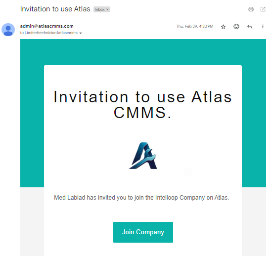
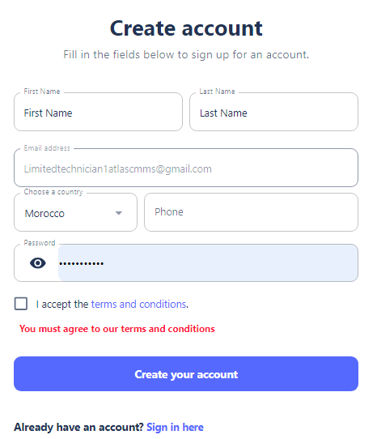
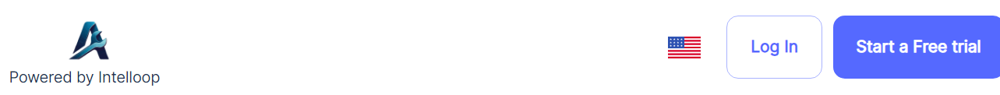
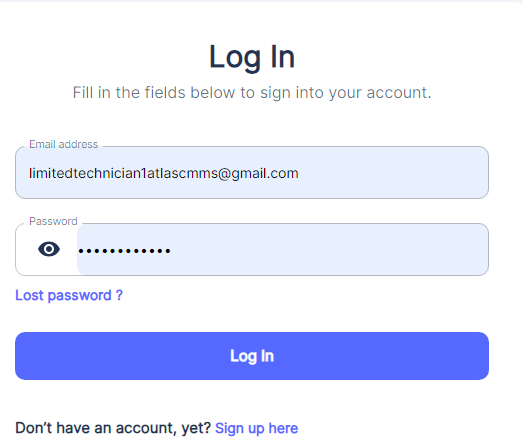
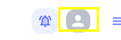
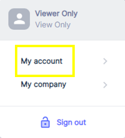
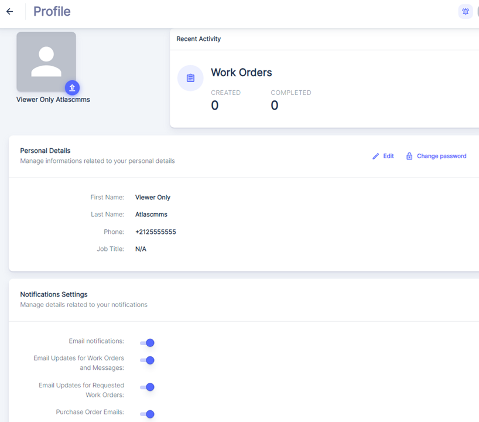

---

label: Company Already Using Atlas Cmms
order: 10
---
#### Create User account

If your organization has an existing ATLAS CMMS account, the subscription process will involve the admin assigning you a user role and permissions. Here are the steps:

1. The admin will add you to the "People & Teams" module, assigning you a specific user role like Technician, Manager, etc.
2. You will receive an email invitation from "[admin@atlas-cmms.com](mailto:admin@atlas-cmms.com)" with the subject "Invitation to use Atlas CMMS".
3. Open the email, which will look like this:

The email contains an "Invitation to use Atlas CMMS" message stating that you have been invited to join the company's team on Atlas with your assigned role. There is a green "Join Company" button to accept the invitation.

1. Click the "Join Company" button in the email.
2. This will open a "Create account" form in your web browser, which looks like:

1. Fill out the "Create account" form with your details like First Name, Last Name, Email, Country, Phone, and choose a secure Password.
2. Check the box to accept the terms and conditions.
3. Click the "Create your account" button to submit the form.
4. Your ATLAS CMMS account is now created, and you can log in using your email and password to start using the software based on your assigned role permissions. To log in, access the Atlas Landing page Or Atlas Mobile App and click the "Login" button.

then:

#### Edit User Profile

Once logged in, you can change your account details by clicking on the User Icon in the top\-right corner of the interface.

From the dropdown menu, select "My Account" to access your account settings.

You will then see a window similar to the one shown in below picture, which displays your current account information and provides options to update your details.

In this window, you can make the following changes:

__Personal Details__

- Edit your Profile picture, First Name and Last Name by clicking on the "Edit" button next to the "Personal Details" section.
- Update your Phone Number by entering the new number in the provided field.
- Change your Job Title by modifying the text in the "Job Title" field.
- Change Your Password.

#### Notifications Settings

In the "Notifications Settings" section, you can manage your preferences for receiving email notifications related to various activities within the ATLAS CMMS system.

After making any desired changes to your notification settings, click the "Save" button to apply the new preferences.
