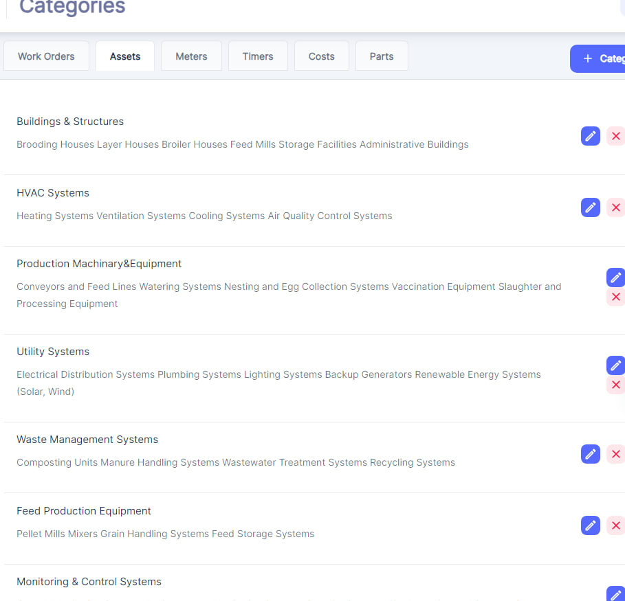
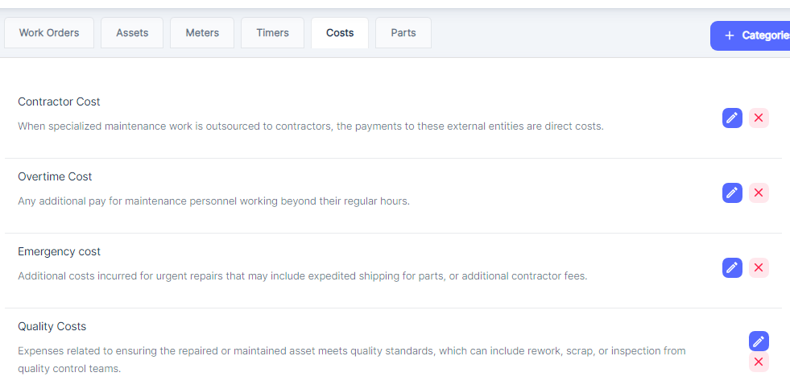
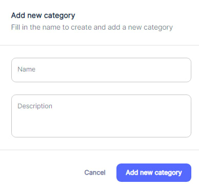

#### Overview of Categories

Categories in a Computerized Maintenance Management System \(CMMS\) play a crucial role in organizing and classifying various aspects of maintenance operations. They provide a structured way to group and filter data, enabling efficient management, analysis, and reporting. Let's explore the different categories that ATLAS CMMS offers and their significance.

Establishing relevant categories and train the team on their proper usage, benefits and implications is crucial for a more efficient maintenance management using Atlas CMMS.

To configure or visualize Categories, click on Categories at bottom left side from Menu:

Then you can visualize:

For each of these areas or sets of categories  \(Work Orders, Assets, Meters, etc.\), the user has the ability to manage the corresponding categories. They can perform actions such as:

1. Deleting an existing category item.
2. Modifying the details of an existing category items
3. Adding a new category item that we will see by the end of this chapter

#### Areas or Sets of categories

##### Work Order Categories

Work order categories help classify maintenance tasks based on their nature and purpose. Common categories include:

\- Preventive: Scheduled maintenance activities performed to prevent equipment failures.

\- Corrective: Unplanned repairs or actions taken to restore equipment to working condition after a failure.

\- Predictive: Maintenance tasks based on condition monitoring and data analysis to predict potential issues.

\- Inspection: Routine checks and assessments of equipment condition.

\- Calibration: Activities to ensure equipment operates within specified parameters.

Categorizing work orders allows for better prioritization, resource allocation, and tracking of maintenance efforts.

##### Asset Categories

Asset categories enable the organization of equipment, machinery, and other physical assets based on their type, function, or location. Some examples include:

\- Buildings & Structures: Administrative buildings, storage facilities, etc.

\- HVAC Systems: Heating, ventilation, air conditioning, and air quality control systems.

\- Production Machinery & Equipment: Conveyors, watering systems, processing equipment, etc.

\- Utility Systems: Electrical distribution, plumbing, backup generators, renewable energy systems.

\- Waste Management Systems: Composting units, wastewater treatment systems, recycling systems.

\- Feed Production Equipment: Pellet mills, mixers, grain handling systems, feed storage systems.

\- Monitoring & Control Systems: Sensors, control panels, and automation systems.

Proper asset categorization facilitates maintenance planning, inventory management, and asset lifecycle tracking.

##### Meter Categories

Meter categories are used to classify various types of meters and gauges that measure and monitor equipment performance or environmental conditions. Examples include:

\- Temperature Meters: Thermometers, thermal imaging cameras, etc.

\- Pressure Meters: Pressure gauges, manometers, etc.

\- Flow Meters: Flowmeters for liquids, gases, or solids.

\- Vibration Meters: Vibration analyzers, accelerometers, etc.

\- Electrical Meters: Voltmeters, ammeters, power meters, etc.

Categorizing meters helps in tracking and analyzing equipment condition, enabling predictive maintenance strategies.

##### Timer Categories

Timer categories are used to track and manage the time spent on various maintenance activities. Some common categories include:

\- Response Time: The time from when a work order is issued until work begins.

\- Wrench Time: The actual time spent on the physical work of repairing or maintaining equipment.

\- Inspection/Diagnosis Time: Time taken to assess equipment, troubleshoot, and identify the root cause of the problem.

\- Cleaning Time: Time required to clean the work area after the job is completed.

\- Documentation Time: Time spent completing work orders, recording part\-time costs, and documenting the process.

\- Administrative Time: Time spent on non\-maintenance activities, such as attending meetings or completing administrative duties.

\- Calibration Time: Time spent calibrating equipment to ensure it operates within its intended parameters.

\- Quality Control Time: Time devoted to inspecting and testing maintenance to ensure the work meets quality standards.

Tracking time spent on maintenance activities helps in resource planning, cost analysis, and identifying areas for process improvement.

##### Cost Categories

Cost categories in a CMMS allow for the tracking and analysis of various expenses associated with maintenance operations. Some common cost categories include:

\- Contractor Cost: Payments made to external contractors for specialized maintenance work.

\- Overtime Cost: Additional pay for maintenance personnel working beyond their regular hours.

\- Emergency Cost: Additional costs incurred for urgent repairs, such as expedited shipping for parts or additional contractor fees.

Proper cost categorization enables accurate budgeting, cost control, and financial reporting for maintenance operations.

##### Parts Categories

Parts categories help organize and manage the inventory of spare parts and consumables used in maintenance activities. Examples include:

\- Mechanical Parts: Bearings, gears, seals, springs, shafts, pulleys, belts, couplings.

\- Electrical Parts: Fuses, relays, switches, circuit breakers, transformers, capacitors.

\- Electronic Components: Sensors, printed circuit boards \(PCBs\), LEDs, diodes, integrated circuits.

\- Pneumatic Components: Valves, cylinders, compressors, and other pneumatic components.

\- Hydraulic Components: Pumps, motors, valves, and other hydraulic components.

Categorizing parts enables efficient inventory management, procurement planning, and tracking of spare parts usage and costs.

By leveraging these various categories within ATLAS CMMS, organizations can streamline their maintenance operations, improve data organization, and gain valuable insights for decision\-making and continuous improvement.

#### Add new Category Item

To add a new category within any of these Sections, the user can

1\-Choose the Set of categories where the new category should be added.

2\-Click on the "\+ Category Item" button, which will open a form similar to the one shown in below picture.

The "Add new category item" form prompts the user to enter the following information:

1. Name: This is a required field where the user must provide a name for the new category they want to create.
2. Description: This is an optional field where the user can enter a brief description or additional details about the category.

Once the user has filled in the necessary information, they can click the "Add new category" button to save and create the new category within the respective area \(Work Orders, Assets, Meters, etc.\).

Alternatively, if the user decides not to create a new category, they can click the "Cancel" button to discard any entered information and close the form.

This functionality allows users to customize and organize the various aspects of their maintenance operations by creating categories that align with their specific needs and workflows. For example, under the Assets area, a user could create categories for different types of equipment, such as "HVAC Systems," "Production Machinery," or "Utility Systems."

By providing the ability to add, modify, and delete categories, the maintenance management software offers flexibility and adaptability to accommodate the unique requirements of different organizations and industries.
