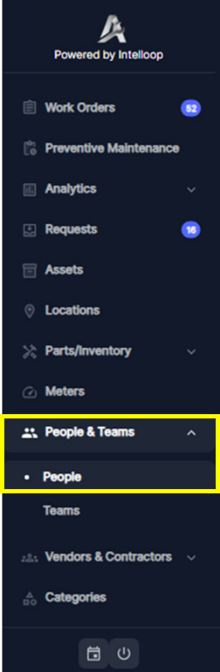
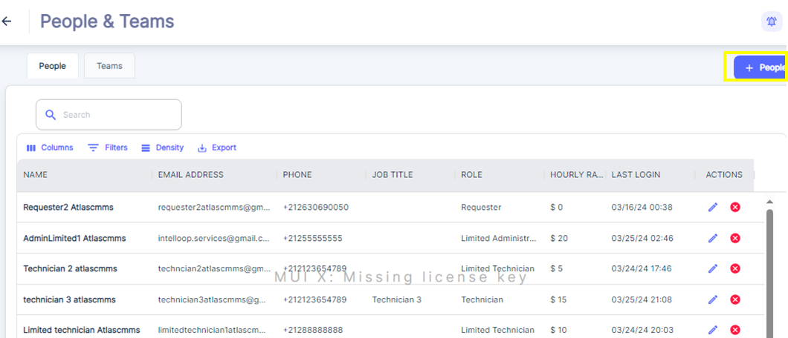
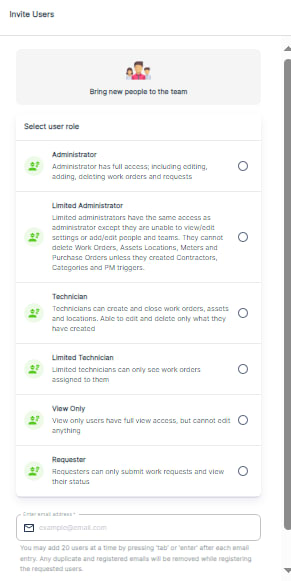
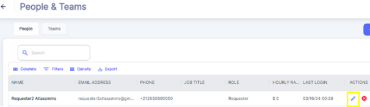
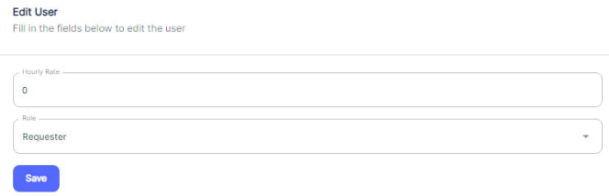

---

label: People Configuration
order: 1
---
Understanding how to properly configure user roles, permissions, and access levels is crucial for ensuring the secure and efficient operation of such systems.

Here are the steps to configure people and teams in the CMMS application:

1. Access the "People & Teams" section from the main navigation menu and Click People.
2. This will display the current company team members with columns showing their name, email, phone, job title, role, hourly rate, and last login details

1. To add new team members, click the blue "\+ People" button located at the top right corner of the screen.
2. This will open a new window or interface to "Invite Users" .

1. In the "Invite Users" window, select the appropriate user role from the list by checking the corresponding checkbox. The roles include Admin, Limited Admin, Technician, Limited Technician, Viewer, and others configured Roles as per previous chapter “Customized Roles”
2. After selecting the role, enter the email address of the person you want to invite in the provided field.
3. Click the "Invite" button to send the invitation.

The invited user will receive a subscription email or invitation to join the team/organization on the platform. Once the invited user completes his configuration steps by following the instructions in the chapter Case 1: Company Already Using ATLAS CMMS, their account will be properly set up within the application. They can then log in using their new credentials and start using the platform based on the role/permissions granted by the admin who sent the invitation.

Some additional notes:

1. You can add up to 20 users with same role at a time by pressing 'Tab' or 'Enter' after each email entry. Any duplicate or already registered emails will be automatically removed during the registration process.
2. The admin has the ability to modify information related to other users within the system. By accessing the "Edit" under “Action”, the admin can update the user Hourly rate and role assignment.

           

1. As an admin, you have the ability to delete users from the system. This might be necessary if a user is no longer part of the maintenance team or has left the organization. For example, if a technician resigns, you can remove his user account from the CMMS.
2. However, if you need to recreate a user account with the same email address that was previously deleted, you cannot do so directly. In this case, you will need to contact the Atlas CMMS support team to unblock the situation and allow the email address to be reused.

By following these steps, you can efficiently manage the people and teams within your CMMS application, ensuring that only authorized personnel have access to the system and their roles are properly assigned.

A well\-designed user management system allows organizations to control who can access sensitive data and perform critical functions within the application. By assigning appropriate roles and permissions, companies can maintain data integrity, comply with regulatory requirements, and prevent unauthorized actions that could lead to costly errors or security breaches.
