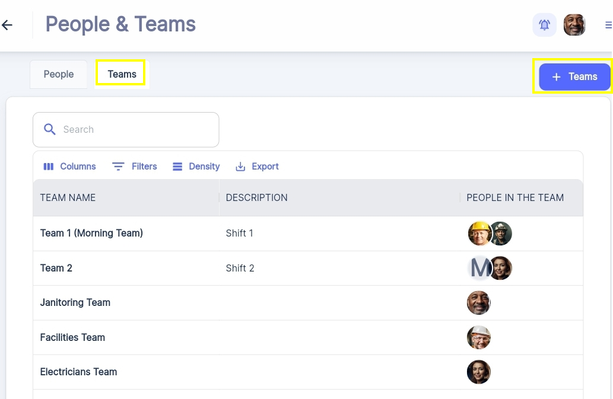
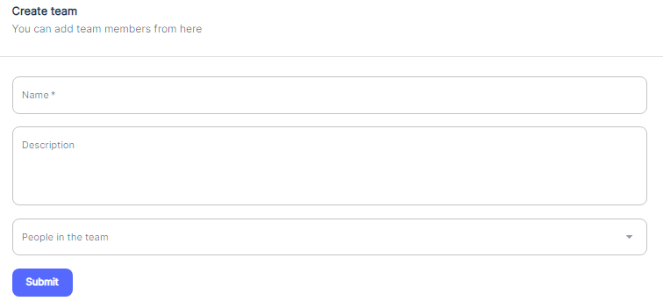

Under "Teams" tab within the "People & Teams" section, you can view all the existing teams, their descriptions, and the members assigned to each team.

To create a new team:

1. Click on the "\+ Team" button located at the top right corner of the "Teams" interface.

1. Enter a descriptive "Team Name" and provide a brief "Description" to clarify the team's purpose or area of responsibility.
2. Assign team members by selecting the appropriate users from the available list.
3. Save the new team configuration.

Once teams are created, you can easily assign work orders, preventive maintenance tasks, or other maintenance activities to specific teams based on their expertise, area of responsibility, Availability periods…. This ensures that the right people are working on the right tasks, improving efficiency and accountability.

Additionally, you can modify existing teams by editing their names, descriptions, or team member assignments as needed. This flexibility allows you to adapt to changing organizational structures or maintenance requirements over time.

By leveraging the user management and team configuration capabilities within ATLAS CMMS, you can maintain a well\-organized and efficient maintenance operation, with clearly defined roles, responsibilities, and collaboration channels for your team members.

Next, we will explore how to record your Location, Assets and Parts details within ATLAS CMMS.
