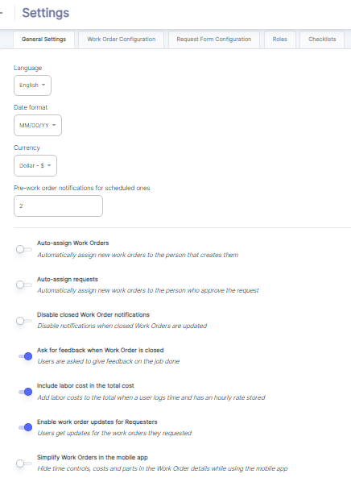

---

label: General Settings
order: 10
---

1. __Language Selection__  
   The Admin can choose the default language for the ATLAS CMMS interface from the "Language" dropdown. This setting allows the system to be configured for users who speak different languages, promoting accessibility and ease of use.
2. __Date and Currency Formats__  
   Under "Date format" and "Currency", the Admin can set the preferred formatting for displaying dates and currency values throughout the CMMS application. Ensuring these formats align with organizational or regional standards is important for consistent data entry and reporting.
3. __Pre\-work order notifications for scheduled  Ones:__

This setting allows you to specify when the system should trigger notifications for scheduled PM tasks.  Notifications will be sent a specified number of days __before the scheduled start date of the PM task__. This automation ensures that maintenance teams are alerted in advance of upcoming tasks, allowing for proper preparation and resource allocation.

1. __Work Order Assignment Rules__  
   The Admin can configure rules for automatically assigning new work orders by checking the relevant options:

- "Auto\-assign Work Orders" to the creator
- "Auto\-assign requests" to the approver

1. __Notification Settings__  
   The Admin has control over notifications related to work orders, such as disabling notifications for closed work orders or prompting for feedback when orders are closed. These settings impact communication and data collection workflows.
2. __Cost Tracking Configuration__  
   The Admin can enable options to "Include labor cost in the total cost" and "Enable work order updates for Requesters". These settings allow for comprehensive cost tracking and visibility into work order updates for relevant stakeholders.
3. __Mobile App Settings__  
   The "Simplify Work Orders in the mobile app" option gives the Admin control over the level of detail displayed for work orders in the mobile app, allowing optimization for field technician needs.1

By walking through these general settings, the Admin can tailor the initial ATLAS CMMS configuration to align with the organization's processes, preferences, and unique requirements right from the start. 
