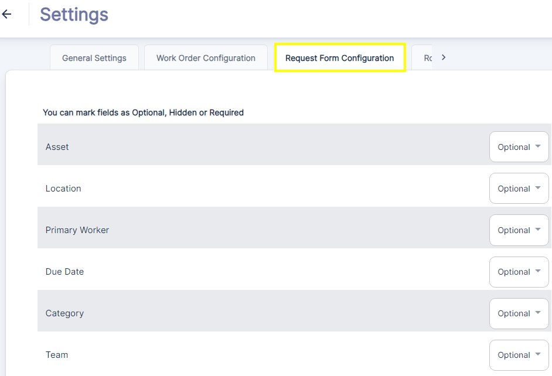

---

label: Request Form Configuration
order: 8
---

The Request Form Configuration settings allow admins to customize the fields and options that requesters need to fill out when submitting a new work request in ATLAS CMMS.As stated at the top, you can mark each field as Optional, Hidden or Required based on your organization's specific information needs for work requests.The configurable fields include:

1. __Asset__: This dropdown allows the requester to specify the asset or equipment the request is related to. You can make this field optional or required.
2. __Location__: This dropdown lets the requester select the location or site where the issue occurred. Making this required ensures location data is captured.
3. __Primary Worker__: You can optionally allow requesters to assign a primary worker right on the request form.
4. __Due Date__: This calendar field enables requesters to suggest a desired due date for completing the work.
5. __Category__: This dropdown menu allows categorization of the request type, such as Repair, Preventive Maintenance, Installation etc.
6. __Team__: If you have defined multiple maintenance teams, this dropdown allows routing the request to the appropriate team.

By configuring which request fields are mandatory, optional or hidden, you can streamline the request submission process. Only ask for the information critical for your workflow while avoiding excessive data entry for requesters.This tailored request form ensures you capture the right details upfront, enabling more efficient work intake, prioritization and assignment of requests by the maintenance team.Let me know if you need any other details on configuring the work request form in ATLAS CMMS\!
