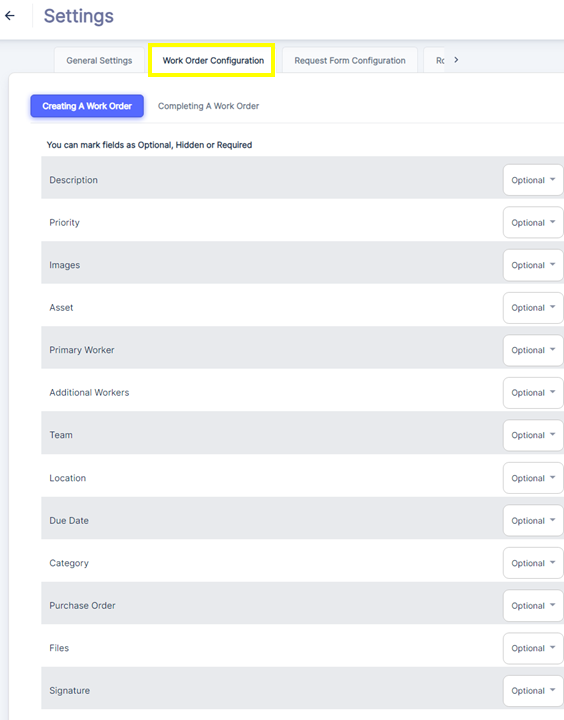
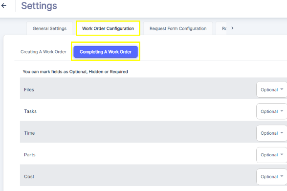

#### WO Creation Settings

The Work Order Creation settings allow admins to configure the fields and options available when creating new work orders in ATLAS CMMS. As shown in the image, you can mark fields as Optional, Hidden or Required based on your organization's processes. Key settings include specifying the Description details, setting Priority levels like Low/Medium/High, attaching relevant Images or documents, linking to the associated Asset, assigning a Primary Worker and Additional Workers, selecting the Team and Location, setting a Due Date, categorizing the type of work, linking to a Purchase Order if needed, and enabling e\-Signatures.

Admins have full control over which fields are mandatory versus optional for work order creation. This ensures technicians capture all the critical information while avoiding excessive data entry for non\-essential fields.

#### Completing Work Orders Settings:

**Once work is performed, technicians or supervisors can access the Completing a Work Order section to properly close out the maintenance activity. Key steps include:

1. Uploading any final Files like testing reports or images documenting the completed work.
2. Adding Tasks performed with descriptions and time entries.
3. Logging the labor Time spent on the work order.
4. Specifying Parts used from inventory including quantities and costs.
5. Entering the total Cost breakdown for the completed work.

By configuring these completion details, ATLAS full captures labor, materials and overall cost data for each work order. This comprehensive tracking enables accurate reporting, analysis of maintenance spend, and benchmarking of key performance metrics. Admins can specify which completion fields are required versus optional based on their organization's reporting needs and maintenance processes. The flexibility in setting up work order creation and completion ensures ATLAS adapts to your operations.