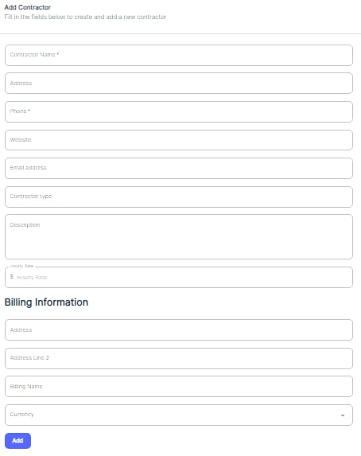

---

label: Contractor Configuration
order: 9
---
Similarly, to add a new contractor, users can access the form by choosing Contractor then “\+Contractor”\).

This form captures information such as the contractor's name, address, phone, website, email address, contractor type, description, and hourly rate. Additionally, it includes a section for billing information, where users can provide the billing address, billing name, and currency. Once all the necessary details are entered, clicking "Add" will create the new contractor record within the system.

By following these steps, users can efficiently manage and maintain up\-to\-date records for both vendors and contractors, ensuring that critical information is readily available for tasks such as assigning Work Orders, cost control, contractors monitoring…
