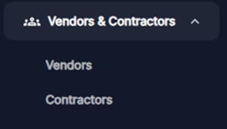
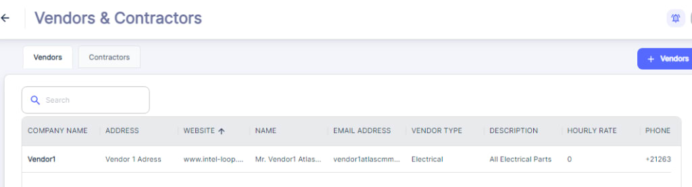
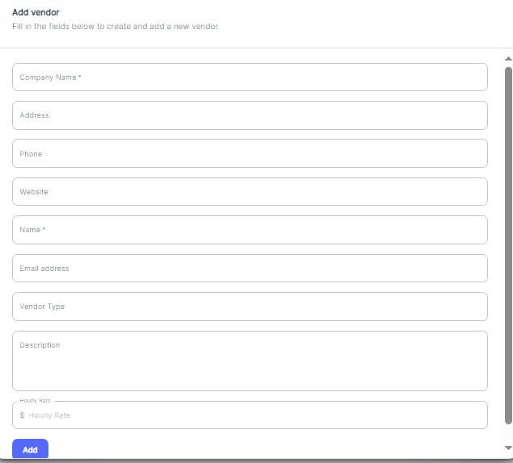

---

label: Vendor Configuration
order: 10
---

To access vendor and contractor records within this system, users can navigate to the "Vendors & Contractors" section from the main menu.

Once in this section, a table view of existing vendors and contractors, listing key information such as company name, address, website, contact details, vendor/contractor type, description, hourly rate, and phone number.

You can Edit information related to Vendor any time.

### Vendor Configuration

To add a new vendor, users can click the "\+ Vendors" button, which will open the following form.

This form allows users to enter comprehensive details about the vendor, including company name, address, phone, website, contact name, email address, vendor type, description, and hourly rate. After filling out the required fields, users can click "Add" to create the new vendor record.
