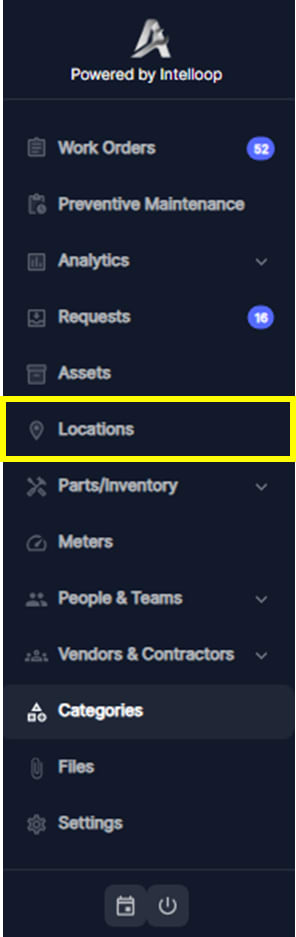

---

label: Accessing Locations
order: 9
---

1. From the left sidebar menu, locate and click on the "Locations" option to access the Locations Record module

This will open the Locations view, displaying a list of existing locations organized in a table format.
