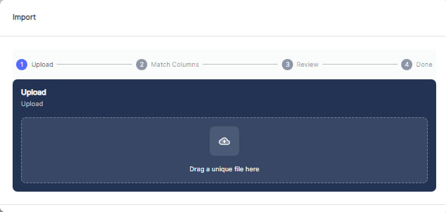

---

label: Managing Locations
order: 9
---
While in the detailed view of a location, you can perform various management tasks:

- __Add or Edit Location__: Use the "\+ Asset" button to add new assets to the Location or click on an existing asset to edit its details.
- __Create Work Orders__: Click on the "\+ Work Order" button under Location details to initiate new maintenance tasks for the location.
- __Update Floor Plans__: Add new floor plans or edit existing ones to keep the facility's layout up\-to\-date.
- __Manage Personnel__: Use the people tab to assign roles, update contact information, and manage the facility's workforce.

By utilizing these features, The Admin can effectively oversee and maintain the operational integrity of their locations. Atlas CMMS provides a centralized platform for managing all aspects of a locations, ensuring that every component is accounted for and maintained efficiently.

#### Adding New Locations

There are two options for creating locations in the CMMS system:

###### Manual Creation

In the Locations view, click the "\+ Location" button at the top right corner of the screen.

1. A new window will open to enter details for the new location.
2. Fill in required fields like location name, address, and any other relevant information.

1. If applicable, specify the parent location to establish a hierarchical relationship.
2. During location creation, we can also assign workers, teams, vendors, and contractors to specific locations. Additionally, you have the option to attach pictures directly from your mobile camera or by dragging and dropping image files. Furthermore, you can attach relevant files to a location, such as floor plans, site maps, equipment manuals, or safety documents, which can provide valuable context and information for that particular location.

Note 1: Assigning workers, teams, vendors, and contractors to locations is beneficial for several reasons:

- It helps establish clear responsibilities and accountability for maintenance tasks at each location.
- It enables efficient work order assignment and resource allocation based on location.
- It supports location\-specific reporting and analysis of maintenance activities.
- Attaching pictures can be useful for visually documenting the layout, equipment, or specific areas of a location, aiding in better understanding and communication.

1. Once all necessary details are provided, click "Save" or "Create" to add the new location.

###### Importing from Template

1. Download the location template from the Atlas CMMS website under "Import Templates".

1. Fill out the template with your location details, ensuring parent locations are listed before child locations.
2. In the CMMS application, click the three vertical dots on the right side and select "Import".

Then:

Then Click: “Start Import Process”

1. Either drag and drop the filled template file or select it from your device.
2. Follow the prompts to complete the import process successfully.
3. After importing, click the refresh button near the three vertical dots to view the imported locations.

It is crucial to start with parent locations before listing child locations when filling out the template. This is because the CMMS system relies on a hierarchical structure to organize and manage locations effectively.

By defining parent locations first, you establish the top\-level locations in the hierarchy. Child locations can then be nested under their respective parent locations, reflecting the real\-world relationships and dependencies between different facilities or sites.

Maintaining this hierarchical structure ensures proper data organization, enables efficient navigation and filtering of locations, and supports accurate reporting and analysis based on location hierarchies. It also allows for easier maintenance and updates, as changes to a parent location can be propagated to its child locations as needed.

#### Modifying Existing Location Details

1. To modify the details of an existing location, locate the desired location in the list.
2. Click on the respective row or the edit icon \(pencil symbol\) in the "Actions" column.
3. This will open the "Edit Location" form, where you can update various fields such as the location name, address, contact information, and any other relevant details.
4. After making the necessary changes, click "Save" to apply the modifications to the selected location.
