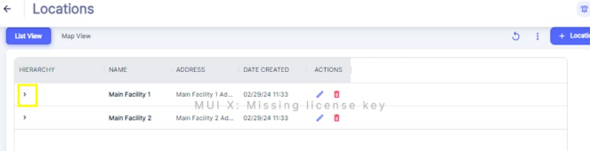
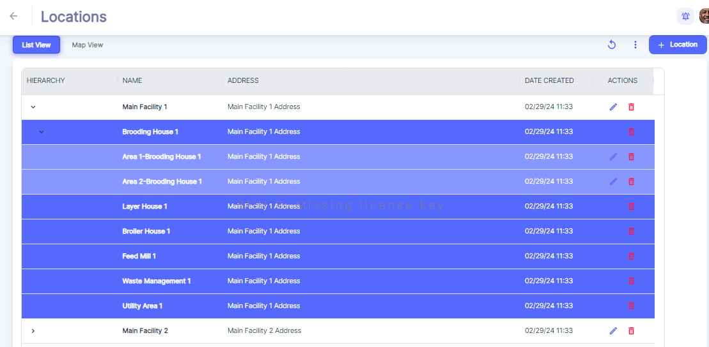
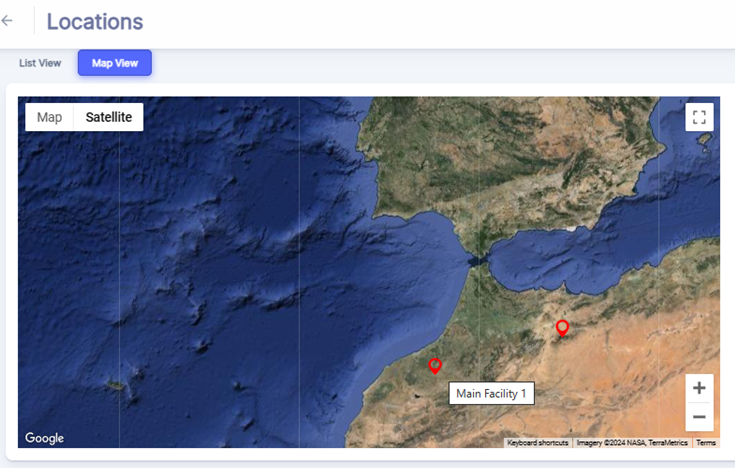
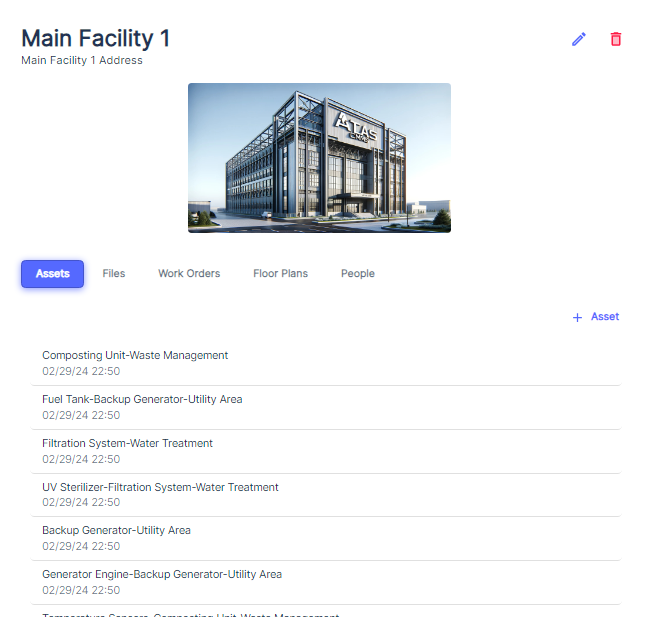

---

order: 10
---
#### **List View \(Hierarchical View\)

1. The table shows a "Hierarchy" column with small arrows next to some location names.
2. Click on the arrow icon to expand and view any child locations \( or Sub\-location which could be anything from individual buildings, floor levels to separate locations altogether\) nested under a parent location
3. This hierarchical structure allows you to see the relationship between different locations within your organization.

#### Map View

In case of Location had been put on Map, you may visualize the map

Useful for companies managing spaced locations.

#### View Location Details

To view details about a specific location, simply click on the corresponding row or On Label on Map. This action will take you to a detailed view of the location, where you can access various tabs related to the facility's management.

Upon selecting a location, you will be presented with a series of tabs that provide different perspectives on the facility:

1. __Assets Tab__: This tab lists all assets associated with the location. Each asset is timestamped, indicating its creation date. This view allows you to monitor the status and maintenance history of each asset within the facility. You can continue to view Asset details by clicking on related row.
2. __Work Orders Tab__: Here you can see a list of all active and historical work orders for the location. This includes details such as the Title of Work Order and its creation date.
3. __Floor Plans Tab__: The floor plans tab provides details about location floor space.
4. __People Tab__: This Tab is dedicated to managing personnel or employee information related to the facility. 
