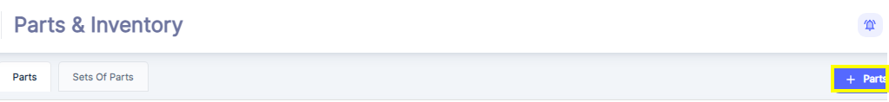
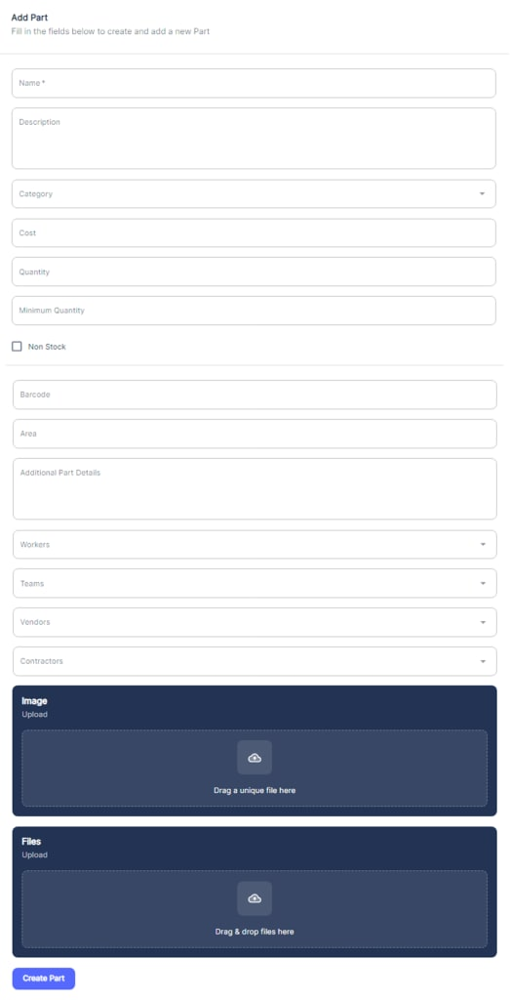
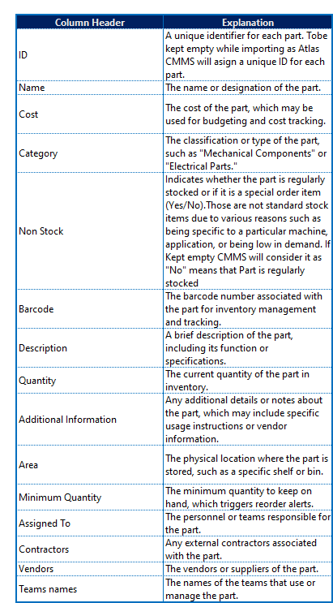
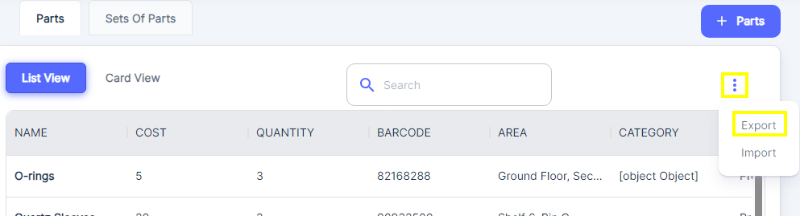
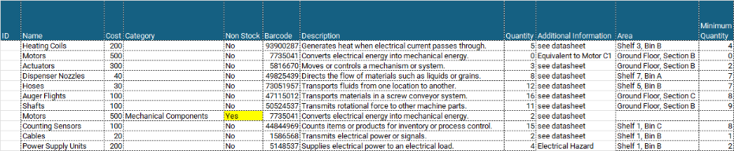
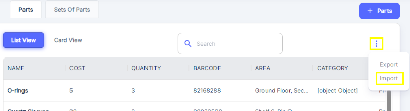
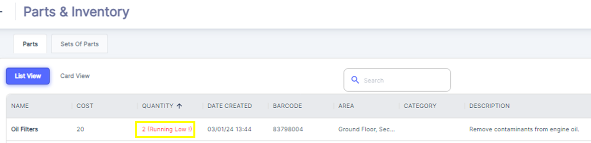

---

label: Adding New Parts
order: 9
---
To add a new part to the CMMS system, click on the "\+ Part" button .

This will open the "Add Part", where you can enter the part's details.

#### Manual Creation

In the "Add Part" form, fill in the required fields such as: Name, Description, Category, Cost, Quantity, Minimum Quantity, Barcode, Area, Additional Part Details \(if applicable\)…

You can also assign the part to specific workers, teams, vendors, or contractors using the respective dropdown menus. Additionally, you have the option to upload an image of the part and any relevant files or documents \(e.g., manuals, specifications\) by dragging and dropping or browsing for the files.

Once all the necessary information is provided, click the "Create Part" button to add the new part to the Atlas CMMS system.

#### Importing from Template

If you have a large number of parts to add, ATLAS CMMS system also provides an import option. To use this feature:

1\-Downloading and Populating the Template

The template for Parts import can be downloaded from the Atlas CMMS website or directly from the CMMS interface. To download the template:

\*Click on the three vertical dots at the right side of the Parts management interface.

\*Select the "Export" option to save the file to your device.

Once the file is downloaded, populate it with the necessary information for each part, following the format provided in the table below:

1. In ATLAS CMMS application, navigate to the Parts/Inventory module and click on the import option
2. Follow the prompts to select and upload the filled template file.
3. The system will process the file and import the parts into the CMMS database.

By leveraging the Parts/Inventory module, you can maintain an accurate and up\-to\-date record of your organization's parts and inventory. This information is crucial for efficient maintenance planning, inventory management, and ensuring that the necessary parts are available when needed, minimizing downtime and maximizing productivity.

__Recommendation for Recording Parts__

It is recommended to record parts in the CMMS before recording assets which we will see in next Chapter. This is because, in the Assets section, you may need to assign specific parts to particular assets or equipment. By having a detailed and accurate parts inventory recorded first, you can ensure that the correct parts are associated with the appropriate assets, which is essential for effective maintenance and inventory management.

__Running Low Flag:__

The Atlas CMMS system includes a feature that allows users to filter and identify parts that are running low in inventory. This feature is particularly useful for maintaining optimal stock levels and ensuring that maintenance operations are not disrupted due to a lack of necessary parts. This alert system helps users to proactively reorder parts before they run out completely, maintaining a seamless supply chain and avoiding potential downtime.To effectively set the minimum quantity for parts, it is important to consider several factors:

- __Consumption Rate__: The average rate at which a part is used over a given period. This helps determine how quickly stock is depleted.
- __Minimum Order Quantity \(MOQ\)__: The smallest amount that can be ordered from the supplier, which may affect how many parts you keep on hand.
- __Order\-to\-Delivery Cycle Time__: The time it takes from placing an order to receiving the parts. Longer cycle times may require higher minimum quantities to prevent stockouts.

Atlas CMMS likely provides a template or tool that can be downloaded from their website to assist users in calculating the appropriate minimum quantity for parts. This template would use the factors mentioned above to suggest a minimum stock level that balances the need to have parts available when needed with the desire to minimize carrying costs associated with excess inventory.
