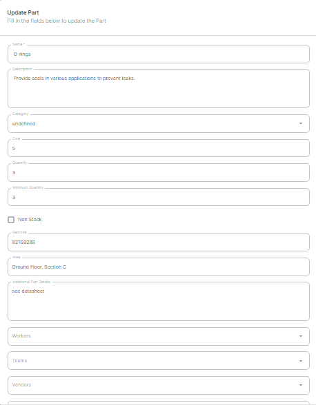

-
    1. To modify the details of an existing Part, locate the desired Part in the list.
2. Click on the respective row.
3. This will open the "Edit Part" form, where you can update various fields such as the cost, location name, description, quantity, Minimum quantity, barcode, contact information, and any other relevant details.

4. After making the necessary changes, click "Save" to apply the modifications to the selected Part.
