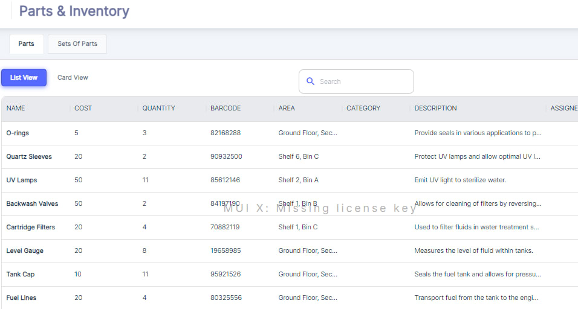
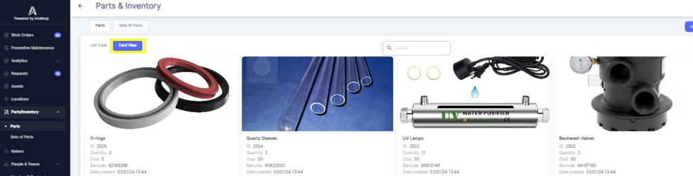
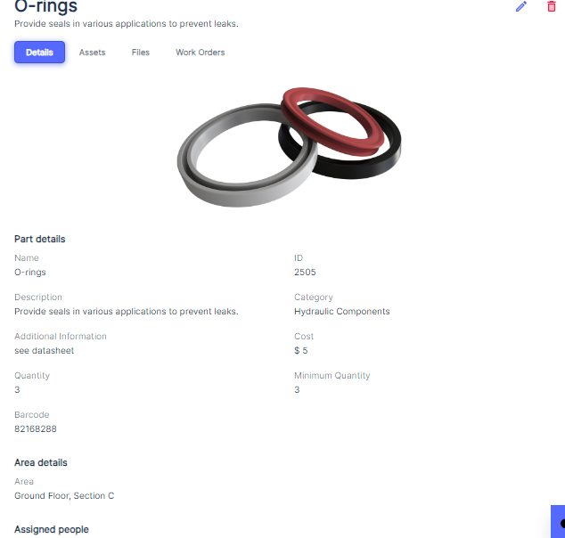

Once in the Parts/Inventory module, you can view the list of existing parts and their details in either the "List View" or "Card View" format.

#### List View

The List View displays all parts in a tabular format, with columns showing the part's Name, Cost, Quantity, Barcode, Area, Category, Description, and any assignments \(workers, teams, vendors, or contractors\).This view provides a comprehensive overview of your parts inventory, allowing you to quickly scan and locate specific parts based on their details.

You can always use “Search” to find Parts.

#### Card View

The Card View presents parts in a more visual, card\-like format, displaying an image of the part \(if available\), along with its name, part number, quantity, and other relevant information. This view can be particularly useful for quickly identifying parts based on their appearance or for parts that are difficult to distinguish by name alone.

#### View Part Details

When Users click on a part, they will be presented with a detailed view of a specific part. This view typically includes:

\- A __visual representation__ or image of the part.

\- __Essential details__ such as the part's name, ID, description, and category.

\- __Financial information__ including the cost per unit and the minimum quantity threshold for reordering.

\- The __storage location__, denoted by the area and possibly a specific bin within that area.

\- A __barcode__ for inventory management and tracking purposes.

Additionally, the interface provides tabs or links that allow the user to delve deeper into the part's usage and history:

\- __Work Orders:__ By clicking on the "Work Orders" tab or link, the user can view a list of all work orders where the part has been used. This includes information on the nature of the work, the dates when the part was utilized, and any relevant details about the maintenance or repair tasks.

\- __Assets__: If the part is assigned to specific assets, the user can click on the "Assets" tab or link to see a list of those assets. This section would show which assets the part is typically used with, providing context for its application and helping with future maintenance planning.

\- __Files__: The user may also access any files or documents related to the part, such as datasheets, specifications, or safety information, by clicking on the "Files" tab or link.

This comprehensive view allows maintenance personnel to quickly understand the part's role within the organization, track its consumption, and make informed decisions about inventory management, procurement, and maintenance scheduling. It ensures that parts are efficiently utilized and replenished, contributing to the overall effectiveness of the maintenance operations.

#### Parts falling short list
