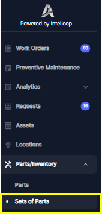
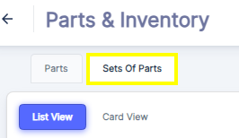
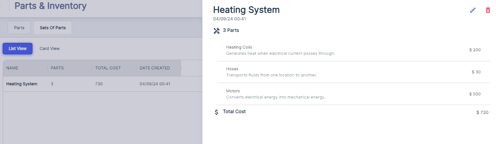

      Or      

The Atlas CMMS system allows users to create and manage "Sets of Parts," which are groups of individual components commonly used together for specific maintenance tasks or equipment assemblies. Organizing spare parts into sets offers several benefits:

1. __Streamlined Maintenance__: Pre\-assembled sets ensure technicians have all necessary parts on hand, reducing downtime and increasing efficiency.
2. __Efficient Inventory Management__: Managing stock levels for complete sets simplifies inventory tracking and procurement, reducing the risk of overstocking or understocking individual components.
3. __Consistent Upgrades and Replacements__: Standardized sets facilitate consistent upgrades or replacements, minimizing errors and omissions.
4. __Optimized Kitting and Assembly__: Pre\-assembled kits optimize kitting and assembly processes, reducing time and effort required for sourcing individual components.

To create a set of parts in Atlas CMMS, navigate to the "Parts & Inventory" module, click on "Sets of Parts," and define a new set by selecting the included parts and their quantities.By leveraging "Sets of Parts," organizations can streamline maintenance operations, improve inventory management, ensure consistency, and optimize kitting and assembly processes, ultimately increasing efficiency and productivity.

Just like individual parts can be added to a work order, sets of parts can also be assigned to work orders in the CMMS system. When a set of parts is used for a maintenance task, the quantity of the entire set will be deducted from the inventory, and the total cost of the set will be added to the overall maintenance cost.For example, consider an "Engine Preventive Yearly Maintenance" set of parts that includes components like engine oil, oil filters, air filters, and other consumables required for an annual engine service. When this set is assigned to a preventive maintenance work order for an engine overhaul, the following would occur:

1. The quantity of the "Engine Preventive Yearly Maintenance" set \(e.g., 1 set\) will be deducted from the inventory.
2. The individual quantities of each component within the set, such as engine oil \(e.g., 5 liters\), oil filters \(e.g., 2 pieces\), and air filters \(e.g., 1 piece\), will also be deducted from their respective inventory levels.
3. The total cost of the "Engine Preventive Yearly Maintenance" set, which is the sum of the costs of all its components, will be added to the overall maintenance cost associated with the work order.

By using pre\-defined sets of parts, maintenance technicians can ensure they have all the necessary components readily available for specific maintenance tasks, reducing the risk of overlooking or forgetting any crucial parts. Additionally, the CMMS system can accurately track the consumption of these sets and their impact on inventory levels and maintenance costs, providing valuable data for inventory management, budgeting, and cost analysis.

Next, we will explore how to record your Assets details within ATLAS CMMS.
