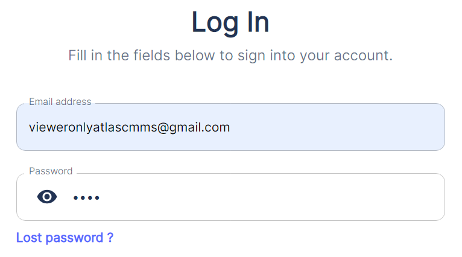
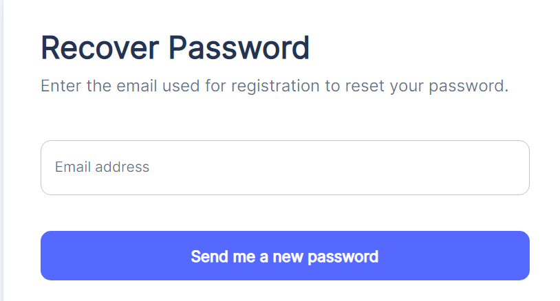
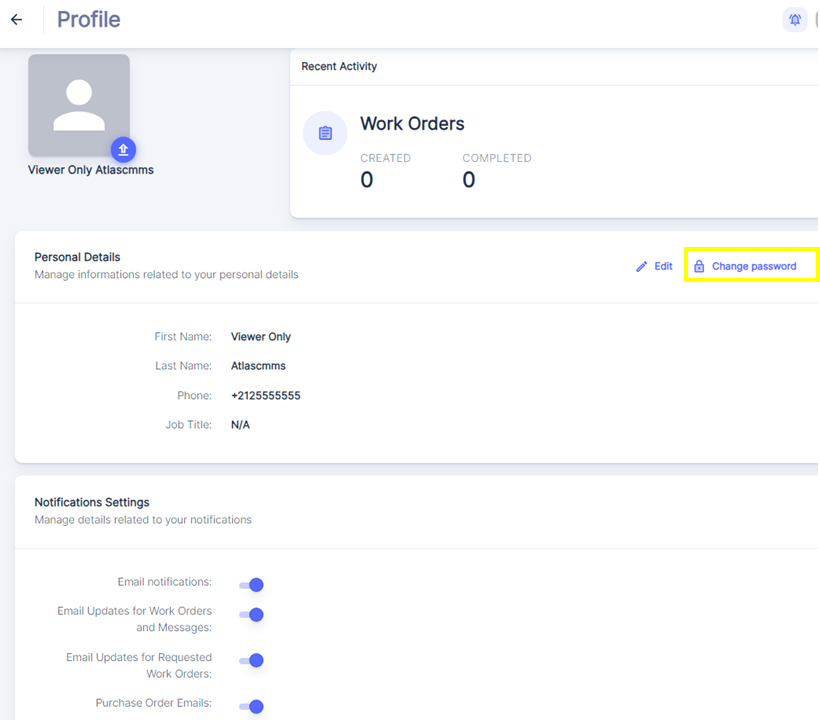
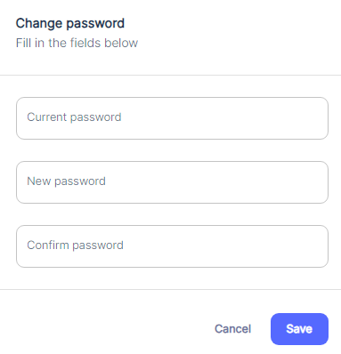

---

label: Annexe 2 Password Reset
order: 1
---

In case of a lost password, click on the `Lost password` link in blue as shown in the below image.

Then ensure to enter the correct email address that you used when subscribing to the service. After entering your email, click the `Send me a new password` button in blue, as seen in picture below:

You will then receive an email with a provisional password, similar to the one displayed in the below image below.

Click on the `Login` button and use the provisional password provided in the email to access your account. Once logged in, you can change your password by following the standard password change process outlined after this paragraph.

#### Change Password:

If you wish to change your account password, click on the `Change password` button in the `Personal Details` section under Your Account Profile Tab. This will open a new window or form where you can enter your current password, followed by your new password and a confirmation of the new password.
