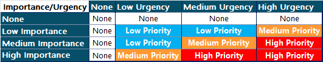

---

label: Tip 1 Priority Assignment
order: 1
---

To assign priority levels to work orders based on their urgency and importance, a structured approach can be very effective. One common method is to use a matrix that categorizes tasks according to these two dimensions. This allows for a clear, organized, and rational basis for prioritization.

Below is a table that outlines how work orders can be classified into High, Medium, Low and None priorities based on their levels of urgency and importance:

### Priority Definitions:
- **None**: Indicates no action required at this time. These are typically not entered into the work order system.
- **Low Priority**: Tasks that are not critical and can be addressed in due course without immediate urgency.
- **Medium Priority**: Important tasks that should be addressed to avoid potential escalation in urgency or impact.
- **High Priority**: Critical tasks that require immediate attention to prevent significant impact on safety, compliance, or operational continuity.

### Usage Notes:
- **Assessment**: It's vital to assess both the urgency and importance of each task accurately to ensure correct prioritization.
- **Flexibility and Adaptation**: The definitions of "low," "medium," and "high" might need adjustment based on specific organizational needs and operational contexts.
- **Dynamic Nature**: Priorities might need to be adjusted as situations evolve. Regular review of the prioritization against current operational needs is advisable.

This adjusted matrix allows for a straightforward approach to prioritizing work orders, ensuring that the focus remains on the most urgent and important tasks while still allowing for flexibility based on the specific context and needs of the organization.