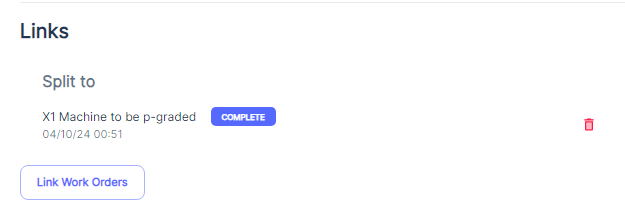
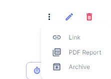

#### Utilizing the Link Work Orders Feature

The `Link Work Orders` feature in Atlas CMMS is a powerful tool designed to create and manage relationships between various work orders. This functionality is essential for organizing and streamlining maintenance workflows, ensuring that all related tasks are coordinated effectively. Here's how to use this feature, along with pertinent examples:

##### How to Link Several Work Orders

or

##### Understanding Link Work Orders Options

When you access the "Link Work Orders" interface, you are presented with several options to define the relationship between work orders

- `Blocked by`: Use this option when a work order cannot proceed until another work order is completed. For example, if Work Order A involves shutting down the power, and Work Order B cannot start without power, then Work Order B is "Blocked by" Work Order A.
- `Blocks`: This is the inverse of "Blocked by" and is used to indicate that the current work order is preventing another from proceeding. In the previous example, Work Order A "Blocks" Work Order B.
- `Duplicate of`: If a work order has been mistakenly created more than once, use this option to link it to the original work order. This helps avoid redundant work and confusion.
- `Duplicated by`: This indicates that the current work order has been duplicated, and another work order exists with the same tasks.
- `Related to`: This option is used to link work orders that are not dependent on each other but are related in context or location. For instance, if Work Order C involves repairing a leak in a pipeline and Work Order D involves inspecting the same pipeline, they are "Related to" each other.
- `Split to`: If a work order is too large or complex and needs to be divided into smaller, more manageable tasks, use this option to link the original work order to the new, smaller work orders.
- `Split from`: This indicates that the current work order has been created as a result of splitting a larger work order into more manageable parts.

##### Practical Examples of Linking Work Orders

- **Scheduled Maintenance**: During a scheduled maintenance shutdown, multiple work orders may be created for different tasks. Linking these work orders using "Related to" can help teams coordinate their efforts without duplicating work.
- **Emergency Repairs**: If an emergency repair work order is created due to an equipment breakdown, it may block other work orders that require the equipment to be operational. Using the "Blocked by" option can help reschedule those affected work orders.
- **Project Management**: For complex projects that involve multiple stages or phases, work orders can be linked using "Split to" and "Split from" to manage the project in smaller, sequential tasks.

By effectively using the "Link Work Orders" feature, maintenance managers can ensure that all related maintenance activities are accounted for and organized logically. This leads to better resource allocation, clearer communication among team members, and a more efficient maintenance process overall.