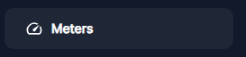
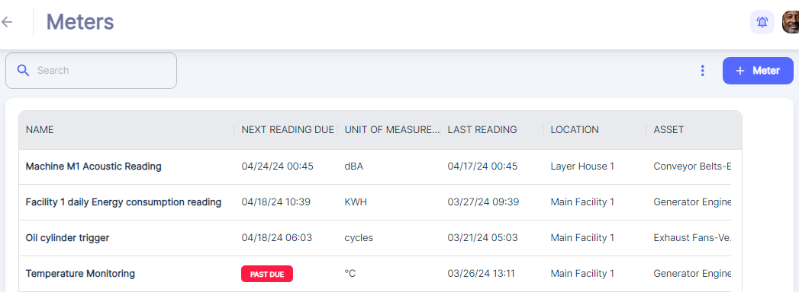
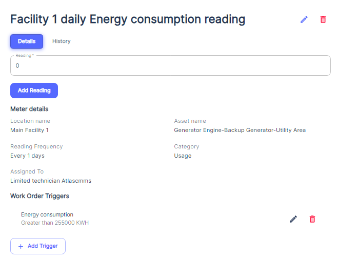
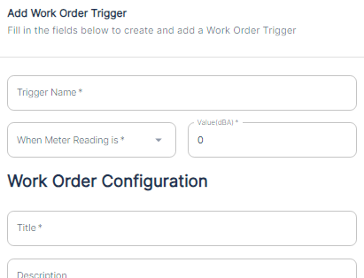

##### Accessing Meters

To access the Meters module within Atlas, users simply need to navigate to the dedicated "Meters" section from the main menu.

##### Viewing Meters

###### General View

When a user clicks on the "Meters" section within the Atlas CMMS, they are presented with a comprehensive view that displays a list of meter records associated with various assets. The interface showcases key information in a tabular format, which includes the following columns:

- __Name__: This column lists the names of the meters, which typically describe the type of reading or measurement the meter is tracking.
- __Next Reading Due__: Indicates the scheduled date and time for the next meter reading to be taken. Meter with Past due reading will be highlighted with Red “Past Due” instead of Next reading view date, the responsible user need to make the reading.
- __Unit of Measure__: Shows the unit in which the meter reading is measured.
- __Last Reading__: Provides the date and time of the most recent meter reading entry, allowing users to see when the last data was captured.
- __Location__: Specifies where the meter is located within the facility, aiding in quick identification and access for maintenance personnel.
- __Asset__: Identifies the specific asset that the meter is associated with.
- __Created By__: Displays the user who created the meter record.
- __Date Created__: Indicates when the meter was initially set up in the system, giving users context for the lifespan and historical data of the meter.

The interface also highlights meters with readings that are due or past due, alerting users to take immediate action.

###### Meter Specific View

The user can know more details about the a Meter clicking the specific row:

users will see several fields that provide important information about the meter and its management:

- __Reading__: In this field, users can enter the meter's reading value. To update it, tap on the meter value and click the "Add Reading" button.
- __Meter Details__: This section includes several descriptive fields:
    - __Location Name__: Indicates where the meter is physically located within the facility.
    - __Asset Name__: Identifies the specific asset that the meter is monitoring.
    - __Category__: Indicate the Meter category. Refer to “[Meter Categories](#_Meter_Categories)”
    - __Reading Frequency__: Shows how often readings should be taken \(e.g., every 1 day\).

The frequency of reading determines the frequency of associated work order submissions.

-
    - __Assigned To__: Lists the technician or team responsible for taking the meter readings.
- __Work Order Triggers__: Here, users can see a list of work orders that are automatically generated when readings satisfy the conditions set for the Meter.
- __History__:

When users click on the "History" tab, a log of all the past readings for the meter will be displayed. This historical data is essential for tracking trends over time and can help in identifying any anomalies or changes in the asset's performance. Each entry in the history log typically includes:

- The recorded value of the meter at the time of the reading.
- The date and time when the reading was taken.

This historical information is crucial for maintenance and facility managers to analyze the performance and condition of their assets, and to make informed decisions based on actual usage and wear data.

##### Setting up a meter

To set up a meter in Atlas CMMS:

- Navigate to the Meters module and click "\+ Meter"

Here is a user guide for creating a new meter using the "Add Meter" form in AtlasCMMS:

__Name:__ Enter a unique and descriptive name for the meter you are adding. This could indicate the type of measurement \(e.g. "Boiler Temperature Meter"\), the asset it is associated with \(e.g. "Pump 3 Flow Meter"\), or its location \(e.g. "East Wing Air Particle Meter"\).

__Unit__: Specify the unit of measurement that this meter will record readings in. Common units include:

- Length/Distance: feet, meters, miles, etc.
- Volume: gallons, liters, cubic feet
- Weight: pounds, kilograms, tons
- Temperature: Fahrenheit, Celsius
- Pressure: PSI, bar, Pascals
- Power: kilowatts, horsepower
- Speed: RPM, MPH

__Update Frequency__: Set how often you want to capture readings from this meter. This can be:

- Time\-based: Every hour, day, week, month, etc.
- Usage\-based: Every X miles, hours, cycles, etc.
- Meter reading based: Whenever the value increases by X

__Category:__ If applicable, select a category that this meter belongs to for easier organization and filtering. Refer to “[Meter Categories](#_Meter_Categories)”

Optionally, you can upload a photo or document related to this meter by dragging the file into the box or clicking to browse files.

__Location:__ Choose the physical location where this meter is installed from the dropdown list of locations in your facility.

__Asset:__ Select the specific asset, equipment or machine that this meter is associated with and measuring.

__Workers:__ Assign one or more workers/technicians who will be responsible for taking readings from this meter.

Once all applicable fields are filled out, click "Add" to create the new meter in Atlas CMMS. The meter will now be available for capturing readings, setting up preventive maintenance schedules, and monitoring asset conditions.

##### Creating  a Meter triggered Work Order

To create a meter\-triggered work order, you first need to ensure that the relevant meter is properly configured in your CMMS. If the meter has not been set up yet, follow the steps outlined in the "[Setting up a meter](#_Setting_up_a)" section to create and configure the meter. Once the meter is in place, you can proceed with creating the meter\-triggered work order using these steps:

1. Navigate to the "Meters" section and open the details view for the specific meter you want to set up a trigger for.
2. In the meter details view, tap the "\+ Trigger" button.

1. This will open the "Edit Work Order Trigger" form. Here you can configure the trigger condition:

-
    - enter a descriptive "__Trigger Name__" for this trigger condition.
    - Under "__When Meter Reading is__", select the appropriate operator from the dropdown \- either "Greater than" or "Lower than". This sets the condition for evaluating the meter reading value.
    - Enter the meter reading value that will trigger the work order generation

1. Next, set up the details for the triggered work order under "Work Order Configuration":
2. For Work Order Configuration options like work order Title, Description, Priority,  work order type, assigning technicians, adding tasks/operations etc., you can Refer to [Editing Work Order](#_Editing_Work_Order) section as those settings are common across manually created and meter\-triggered work orders.
3. Once all the fields are populated, save the trigger. The system will now monitor the specified meter and automatically generate a new work order with the provided details whenever the meter reading condition is satisfied.
4. Optionally, you can associate other triggered work order with same meter by adding more than one Triggered Work Order.

The Atlas CMMS will now monitor the specified meter readings. When the trigger condition is met \(e.g. energy consumption exceeds the set threshold\), the system will automatically generate a new work order based on the configuration you provided.

##### Meter’s Permissions and Notifications

Effective management of meters within a CMMS requires a well\-defined system of permissions and notifications to ensure proper control, accountability, and communication among various user roles. This chapter will explain the various permissions and notifications associated with meter\-related workflows.

###### Permissions

The matrix outlines the permissions granted to different user roles for various actions related to meters. These permissions are designed to maintain control, accountability, and security within the system.

1. __Create a Meter__: Roles such as Admin, Limited Admin, and Technician have the permission to create new meters, ensuring that only authorized personnel can set up meter tracking for assets.
2. __Update Meter Reading__: Technicians and Limited Technicians have the permission to update meter readings, allowing them to input the latest measurements for the assets they are responsible for.
3. __Edit PM Trigger__: Only Admins and Limited Admins have the permission to edit PM triggers associated with meters, preventing unauthorized modifications to the conditions that generate preventive maintenance work orders.
4. __Edit Meter: Assign to Technicians or Teams__: Admins, Limited Admins, and Technicians have the permission to assign meters to specific technicians or teams, ensuring clear accountability for meter reading responsibilities.
5. __Edit Meter: Delete Meter__: Only Admins and Limited Admins have the permission to delete meters, preventing accidental or unauthorized removal of meter data.
6. __Edit Meter: Edit Generated Work Order Status__: Technicians and Limited Technicians have the permission to edit the status of work orders generated by meter triggers, reflecting the progress of maintenance tasks.
7. __Receive Assigned/Reassigned Triggered Work Order__: Technicians and Limited Technicians have the permission to receive and view work orders assigned or reassigned to them based on meter triggers, ensuring they are aware of their maintenance responsibilities.
8. __View Assigned/Reassigned Triggered Work Order Details and Status__: Technicians and Limited Technicians have the permission to view the details and status of work orders assigned or reassigned to them based on meter triggers, enabling them to track and manage their maintenance tasks effectively.

###### Notifications

Similar to preventive maintenance tasks, notifications play a crucial role in keeping stakeholders informed about the status and progress of meter\-related activities. The matrix indicates that notifications are sent through various channels, such as web push notifications, mobile push notifications, and email notifications.

1. __Meter Creation__: When a new meter is created, notifications are sent to the relevant parties, such as the Admin, Limited Admin, and the assigned Technician or Limited Technician. This ensures that everyone is aware of the new meter and can take appropriate actions.
2. __Meter Reading Updates__: When a meter reading is updated, notifications are sent to the assigned Technician or Limited Technician, as well as other relevant parties. This helps maintain accountability and facilitates effective communication regarding asset usage and maintenance needs.
3. __Work Order Generation from Meter Triggers__: When a work order is generated based on a meter trigger condition, notifications are sent to the assigned Technician or Limited Technician, as well as other relevant parties. This ensures that maintenance tasks are addressed promptly and potential issues are not overlooked.
4. __Work Order Status Updates__: As the status of a work order generated by a meter trigger changes, notifications are sent to keep stakeholders updated. This transparency helps maintain accountability and facilitates effective communication regarding the progress of maintenance tasks.

Notifications are essential for maintaining a smooth workflow and ensuring that meter\-related activities are addressed promptly. They help minimize delays, miscommunications, and potential bottlenecks in the asset maintenance process.The forms of notifications for meter\-related activities are similar to those described in the chapter on [Work Order Permissions](#_Permissions) and Notifications, including web push notifications, mobile push notifications, bell notifications, and email notifications.

By understanding the permissions and notifications associated with Meters, users of different roles within Atlas CMMS can effectively collaborate to ensure that meters based maintenance activities are executed efficiently and effectively.

##### Viewing Meter Triggered Work Orders

Users can also view Meter Triggered Work Orders from the main menu under “Work Orders” Refer to:  “Viewing Work Orders” and setting “More Filters” for more finetuning.

##### Editing a Meter

###### Reading \(Recording\) Meter Readings

Meters Reading after Meters Creation

Once a meter has been created and configured in your CMMS following the steps outlined in the "Setting up a meter" section, it is ready to start tracking readings. However, there are a few key things that happen upon meter creation:

__Initial Meter Status__

Immediately after a new meter is added to the system, it will automatically have a status of "Past Due". This indicates that the meter is awaiting its first reading to establish a baseline and schedule future readings.

__Notification to Assigned Worker__

When the meter is created, the CMMS sends out a notification to the worker who has been assigned responsibility for that meter \(as specified during meter configuration\). This notification, delivered via the methods set up in the system \(e.g. email, mobile push notification\), alerts the worker that a new meter has been added and prompts them to perform the initial reading.

See the "Notifications" section for more details on how these alerts are configured and delivered.

__Performing the First Reading__

Upon receiving the notification, the assigned worker should record the first meter reading in the CMMS. This can be done in two ways:

1. Directly from the push notification:

-
    - Locate the meter in the push notification list and click on it to open the meter detail page.
    - Click on "Enter Reading".
    - Input the current meter value and timestamp.
    - Save the reading.

1. From the Meters List:
    - If the meter reading due date has arrived, the meter will be highlighted in red with a status of "Past Due".
    - Locate the meter in the meter list and click on it to open the meter detail page.
    - Click on "Enter Reading" in the Reading tab.
    - Input the current meter value and timestamp.
    - Save the reading.

Periodic Meters Reading

After 1st reading, For next Periodic meters reading, User will have to consult Meter Menu to know what is past due to make a new reading, and what are next reading.

For periodic meters, the next reading date and time will be automatically calculated by the system based on the last reading date and the defined reading frequency. Specifically, the next reading due will be exactly the last reading date plus the reading frequency \(in days\).For example:

- If the last reading was taken on January 1 at 9:00 AM
- And the reading frequency is set to every 30 days
- Then the next reading will be due on January 31 at 9:00 AM

The system calculates this next due date and time to maintain the regular cadence of readings based on the meter's configured frequency.

###### Editing a Meter details

To edit the details of an existing meter, tap on the meter name from the main meter list. This will open the meter details view.In the meter details view , you will see fields displaying the current meter information such as:

- Last Reading
- Location Name
- Asset Name
- Reading Frequency
- Assigned Technician
- Work Order Triggers

To modify these details, tap the pencil icon in the top right corner. This will allow you to edit the following fields:

__Name__: Update the descriptive name for the meter.

__Unit__: Change the unit of measurement the meter records \(e.g. kWh, gallons\).

__Reading Frequency__: Modify how often readings should be taken \(e.g. daily, weekly\).

__Category__: Assign the meter to a different category for organization.

__Image Upload__: Replace or add an image associated with the meter.

__Location__: Change the physical location the meter is installed at.__Asset__: Reassign the meter to a different asset it is monitoring.

__Assigned To__: Modify the technician or team responsible for taking readings.Once you have made the desired changes, tap "Save" to update the meter details.

###### Editing a Meter Trigger

To edit an existing trigger, tap the pencil icon next to the trigger Name. This will open the "Edit Work Order Trigger" and follow the same process of “[Creating  a Meter triggered Work Order](#_Creating__a)” to Edit existing Work Order triggers.

After updating the trigger condition and work order configuration, tap "Save" to apply the new trigger rules. User can also delete an existing trigger by tapping the trash can icon next to it.\( refer to  [Permissions](#_Permissions_1) chapter\)

By editing meters, meter details, and work order triggers, you can customize how Atlas CMMS monitors your critical assets and automates maintenance based on actual equipment usage and conditions.

###### Printing and Archiving a Meter triggered Work Order

Refer to Printing and Archiving [Work](#_Printing_and_Archiving) Order Chapter.

