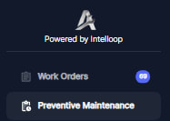
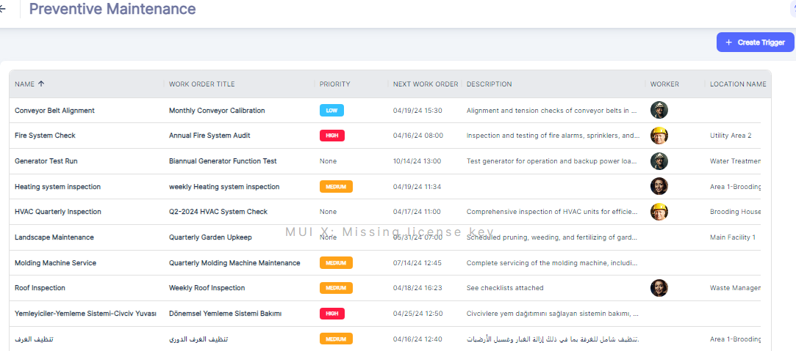
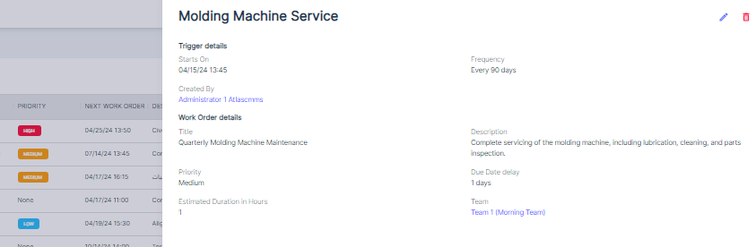
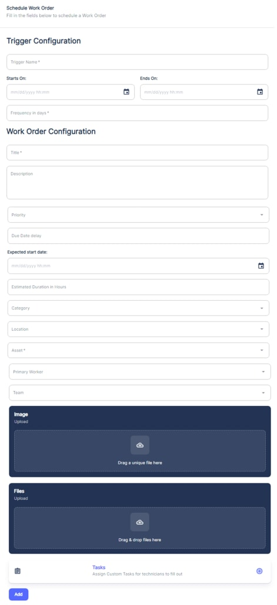
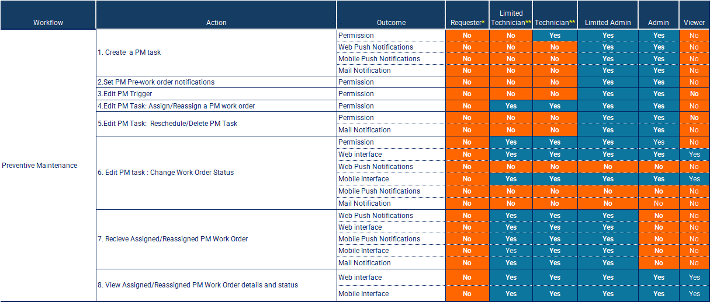

##### Accessing PM

To access the preventive maintenance module in Atlas, users can navigate to the dedicated "Preventive Maintenance" section from the main menu.

##### Viewing PM

###### General View

Once in the preventive maintenance module, users are presented with a view that displays a list of scheduled preventive maintenance tasks or work orders.

This view includes the following fields or columns:

1. __Name:__ The name or description of the preventive maintenance task or trigger.
2. __Work Order Title:__ The title of the associated work order. The "Work Order Title" serves as the official name that will appear on all documentation and records related to the specific preventive maintenance task.

PS:

The “Name” or "Trigger Name" or "PM \(Preventive Maintenance\) Name" typically refers to the name assigned to the maintenance schedule or the specific maintenance routine. It's used internally to track and trigger the maintenance workflow within a management system.

On the other hand, the "Work Order Title" is more specific to the individual task or job that is being issued as a result of the trigger. This title often includes more detail and is what appears on the actual work

1. [__Priority__](../../tips-annexes/tip-1-priority-assignment.md)__:__ The priority level assigned to the work order \(e.g., High, Medium, Low, None\).
2. __Description:__ A detailed description of the preventive maintenance task or work order.
3. __Next Work Order:__ The scheduled date for the next occurrence of the preventive maintenance work order. The next work order date is calculated based on the PM frequency, last work order completion date, and current date \(today's date\).
4. __Worker:__ The technician or maintenance personnel assigned to the work order.
5. __Assigned To:__ The team, department, or group responsible for the preventive maintenance task.
6. __Location Name:__ The location or facility where the asset or equipment is located.
7. [__Category:__](../../initial-setup-and-configuration/configurations/categories-configuration.md) The category or type of preventive maintenance task \(e.g., inspection, lubrication, replacement\).
8. __Asset:__ The specific asset or equipment associated with the preventive maintenance task.

###### PM Task Specific View

The user can know more details about the PM task by clicking on a specific PM task:

##### Scheduling New PM Activity

To create a new scheduled maintenance task, follow these steps:

1. __Access the Schedule Work Order Form__  
   Navigate to the Preventive Maintenance module and click on the "\+ Trigger". This will open the Schedule Work Order form.

1. __Configure the Trigger__  
   In the "Trigger Configuration" section, enter the following details:

- __Name:__ The Trigger Name should be descriptive and reflect the nature of the maintenance task. For example, "Monthly Conveyor Belt Inspection" clearly indicates the Frequency , the Asset and the maintenance activity.
- __Starts On:__ This is the date and hour when the preventive maintenance schedule will begin.
- __Ends On:__ If the PM task has a defined end period, specify it here. If it is an ongoing task without a foreseeable end, this can be left open or set far into the future.
- __Frequency in days:__ Specify the frequency, in days, at which the PM task should recur. To learn more about PM Frequency definition see [Annexe](../../tips-annexes/annex-1-frequency-for-a-pm-task.md)

Important: Start On date will be the initial planned PM task start date and time. All subsequent occurrences of the work order will be based on the maintenance frequency set in days

1. __Set Up the PM related Work Order__

When establishing preventive maintenance scheduling using Atlas CMMS, it's important to understand that Each PM task will have an associated work order. The purpose of the PM work order is to ensure that the personnel have all the necessary information and resources ready by the scheduled date.

In the "Work Order Configuration" section, fill out the following:

1. __Title:__ The title of the work order should be concise and aligned with the Trigger Name. Continuing with our example, the title could be "Conveyor Belt Inspection \- May 2024." This title informs the maintenance team about the specific task and the scheduled month.
2. __Description:__ Provide a detailed description of the maintenance task to be performed.
3. __Priority:__ Assign a priority level \(e.g., High, Medium, Low\) to the work order.
4. __Due Date Delay__: This specifies how many days after the work order is created so that the task must be completed. It is not about how long the task will take, but rather when the deadline for completion is set relative to the work order's creation date. It accounts for the time before the work needs to be completed, providing a buffer for planning, preparation, or delays.
5. __Expected Start Date:__ This is the planned date and time when the work order should commence. It sets a timeline for when the assigned maintenance personnel are expected to start the task.

Important: Expected Start Date should be set before or on the due date.

1. __Estimated Duration in Hours:__ Here, you will indicate the anticipated amount of time the work order will take to complete.

The last 3 fields help in different aspects of maintenance scheduling and should be accurately filled to ensure effective planning and resource management.

For the __remaining fields \(Category, Location, Asset, Primary Worker, Team, Image, File and Task\) __to complete the work order setup, please refer to the " [Creating a Manual Work Order](../../workflows-management/work-order/managing-manual-work-orders.md/#creating-a-manual-work-order)" chapter which provides comprehensive instructions for each section.

__Illustration Examples:__

A facility coordinator needs to schedule a preventive maintenance check on a critical conveyor system that requires regular alignment checks.

1. Work Order Creation: On June 1st, 2024, at 12:00 PM, the coordinator generates a new PM work order in the CMMS for the conveyor system.
2. PM Task Frequency: This particular PM is scheduled to occur every 9 days as part of the ongoing maintenance strategy
3. Due Date Delay: The coordinator assigns a "Due Date Delay" of 4 days. This means the work order is due on June 5th, 2024 at 12:00, allowing for some preparation time following the creation of the work order.
4. Expected Start Date: To ensure that the maintenance is completed on time, the "Expected Start Date" is set for June 4th, 2024, at 08:00 AM. This date is chosen so that the maintenance team has time to address the task within the due date window.
5. Estimated Duration: The job is estimated to take 2 hours, indicating the task was expected to be completed by 10:00 AM on June 4th, 2024.
6. Pre\-order Notifications: the CMMS is programmed to send out pre\-order notifications 2 days before the "Expected Start Date." Therefore, the technician receives a reminder on June 2nd, 2024, about the preventive maintenance task scheduled for June 4th.
7. __CMMS Actions:__

- June 1st, 2024, __12:00 PM__: The PM Work Order for the conveyor system is entered into the CMMS.
- June 2nd, 2024, __08:00 AM__: The system sends out a notification to the assigned technician. This is 2 days ahead of the "Expected Start Date," providing ample time for the technician to prepare.
- June 4th, 2024, __08:00 AM__: The technician is expected to start the preventive maintenance task.
- June 4th, 2024, 10:00 AM: The task is expected to be complete after 2 hours of work.
- June 5th, 2024 at __12:00 PM__: The due date for the work order, based on the set "Due Date Delay" of 4 days.
- Passing June 5th, 2024 at 12:00 PM and Work Order is not yet set to “Complete”, the CMMS will consider  the task as “Overdue”

In this scenario, the timeline allows for proper notification and a logical sequence of work order creation, start date, and due date. This helps ensure that maintenance tasks are planned and completed efficiently without overlapping notifications and work order generation.

Importance for CMMS Users:

As a CMMS user, when you input the preventive maintenance schedule into the system, it's crucial to provide comprehensive details. This ensures that each generated work order is accurate and actionable

By following this process, you can effectively schedule preventive maintenance tasks within the Atlas CMMS. The system will automatically generate work orders based on the configured Schedule and Frequency, ensuring that maintenance activities are performed at the appropriate intervals. This proactive approach helps minimize unplanned downtime, extend asset lifespan, and maintain operational efficiency.

##### PM Permissions and Notifications

Once a preventive maintenance \(PM\) task has been created, it is crucial to ensure that the right people are notified and have the appropriate permissions to act on the task efficiently. This chapter will explain the various notifications and permissions associated with PM tasks, as well as the reasoning behind them.

###### Permissions:

The table outlines the permissions granted to different user roles for various actions related to PM tasks. These permissions are designed to maintain control, accountability, and security within the system.

1. __PM Task Creation__: Roles such as Admin, Limited Admin, or Technician have the permission to create PM tasks, ensuring that only authorized personnel can initiate preventive maintenance activities.
2. __Edit PM Task__: Technicians and Limited Technicians have the permission to edit PM tasks assigned to them, allowing them to update task details or make necessary adjustments.
3. __Reschedule/Delete PM Task__: Only Admins and Limited Admins have the permission to reschedule or delete PM tasks, preventing accidental or unauthorized modifications.
4. __Change Work Order Status__: Technicians and Limited Technicians have the permission to change the status of the associated work order, such as marking it as complete or on hold, reflecting the progress of the PM task.
5. __Receive Assigned/Reassigned PM Work Order__: Technicians and Limited Technicians have the permission to receive and view PM work orders assigned or reassigned to them, ensuring they are aware of their maintenance responsibilities.

###### Notifications:

Similar to work orders, notifications play a crucial role in keeping stakeholders informed about the status and progress of PM tasks. The table indicates that notifications are sent through various channels, such as web push notifications, mobile push notifications, and email notifications.

1. __PM Task Creation__: When a PM task is created, notifications are sent to the relevant parties, such as the Admin, Limited Admin, and the assigned Technician or Limited Technician. This ensures that everyone is aware of the new PM task and can take appropriate actions.
2. __PM Task Assignment/Reassignment__: When a PM task is assigned or reassigned to a technician or team, notifications are sent to the assignee\(s\) and other relevant parties. This helps seamless PM Work Order handover between technicians and Team.
3. __PM Task Updates__: As the PM task progresses, notifications are sent to keep stakeholders updated on any changes in status, comments, or resource assignments. This transparency helps maintain accountability and facilitates effective communication.

Notifications are essential for maintaining a smooth workflow and ensuring that PM tasks are addressed promptly. They help minimize delays, miscommunications, and potential bottlenecks in the preventive maintenance process.

The forms of notifications for PM tasks are similar to those described in the chapter on Work Order Permissions and Notifications, including web push notifications, mobile push notifications, bell notifications, and email notifications.

##### Viewing a PM Work Orders

Users can also view PM Work Orders Scheduling from the main menu under “Work Orders” Refer to:  “[Viewing Work Orders](../../workflows-management/work-order/managing-manual-work-orders.md/#viewing-work-orders)” and setting “[More Filters](../../workflows-management/work-order/managing-manual-work-orders.md/#more-filters)” for more finetuning.

By understanding the permissions and notifications associated with PM tasks, users of different roles within Atlas CMMS can effectively collaborate to ensure that preventive maintenance activities are executed efficiently and effectively, contributing to improved asset reliability and operational performance.

##### Editing a PM

###### Editing a PM Trigger

Users with Admin or Limited Admin profiles have the capability to modify the details of a PM task. This is done by navigating to "Preventive Maintenance" in the Main Menu, selecting the desired PM task, and then clicking on the edit icon represented by a pencil. In this section, both the Work Order \(WO\) Trigger settings and the associated PM Work Order details can be updated..

###### Editing a PM Work Order

For By clicking on a PM task, the user will be presented by the specific PM task view

Refer to [Editing Work Order](../../workflows-management/work-order/managing-manual-work-orders.md/#editing-work-order) Chapter.

##### Printing and Archiving a PM Work Order

Refer to Printing and Archiving [Work](../../workflows-management/work-order/managing-manual-work-orders.md/#printing-and-archiving-a-work-order) Order Chapter.
