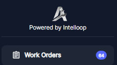

##### Accessing Work Orders

To access the Work Orders module, the user can navigate to it from the main menu.

##### Viewing Work Orders

###### List View:

Once in the Work Orders section, the user will be presented with a comprehensive table view that displays all the active work orders within the system.

This table provides a clear overview of each work order, with columns showing key details such as the work order ID, status \(Open, In Progress, On Hold\), title, priority level \(None, Low, Medium, High\), description, assigned worker, associated asset name, location name, location address, and the date the work order was created and last updated. Furthermore, the interface offers different viewing options, such as a Calendar View or Column view.

###### Calendar View

The Calendar View within the Work Orders module provides a visual representation of scheduled work orders. This view presents work orders in a familiar calendar format:

Users can navigate through the calendar by clicking on __Daily, Weekly Monthly and Agenda Views__

__Monthly: 	__

Today’s Box is marked in different Color \( Biege\).

You can go throughout past and next Months by using left and right arrows at top left and come back to Current Month any time by clicking the bottom between 🡨 and 🡪

__Weekly:__

Today’s Column is marked in different Color \( Biege\).

You can go throughout past and next weeks by using left and right arrows at top left and come back to Current week any time by clicking the bottom between 🡨 and 🡪

__Daily:__

__Agenda View:__

\(Daily, Weekly, Monthly\) , making it easy to identify task distribution and potential scheduling conflicts at a glance .

__Color\-Coded Work Order Blocks__

Within the calendar grid, work orders are represented by colored blocks spanning the duration of the task. The use of different colors helps to distinguish between various Priorities of work orders quickly.

__Scheduling and Conflict Identification__

The Calendar View allows users to easily identify potential scheduling conflicts or overlaps. For instance, if multiple work orders are scheduled for the same day or time slot, the blocks will overlap, indicating a potential resource constraint or the need for prioritization.

This visual representation enables maintenance supervisors to proactively address scheduling issues, reallocate resources, or adjust work order timelines to ensure efficient and effective maintenance operations.

These alternative views enable the user to organize and visualize the work orders in a manner that best suits their preferences and workflow.

###### Filters deployment:

The user can easily filter the work orders based on their __status\(3\)__ or __priority level__ using the respective drop\-down menus located above the table.

4: a search function is available, allowing the user to quickly find specific work orders by entering relevant keywords.

###### More Filters

Additionally, User can open "More Filters" section by clicking on Filter icon on top left side:

The section offers a comprehensive set of filters to refine and customize the view or search results within the application.Here's an explanation of the different filters available:

1. __Type__: This filter allows you to search across preventive, reactive or all work orders .
2. __Asset__: You can filter the results based on specific assets or equipment.
3. __Category__: This filter enables you to narrow down the results by different categories Work Orders.
4. __Team__: If your organization has multiple teams, you can filter the results to show only items associated with a particular team.
5. __Location__: This filter lets you view results based on specific locations or facilities.
6. __People__:
    - __Created By__: Filter the results based on who created the item or record.
    - __Completed By__: Filter the results by the person who completed or closed the item.
    - __Primary Worker__: Filter the results by the primary worker assigned to the item.
    - __Additional Workers__: Filter the results by any additional workers assigned to the item.
    - __Contractors__: Filter the results by contractors associated with the item.
7. __Dates__:
    - __Date Created__: Filter the results based on the date range when the items were created.
    - __Completed On__: Filter the results by the date range when the items were completed or closed.
    - __Updated At__: Filter the results based on the date range when the items were last updated.

These filters provide a powerful way to narrow down and focus on specific subsets of data within the application. For example, you could filter to view only work orders assigned to a particular team, created within a specific date range, and associated with a certain asset or location.

By combining multiple filters, you can create highly customized views tailored to your specific needs, making it easier to find and analyze relevant information quickly and efficiently.

##### Creating a Manual Work Order

To create a new manual work order, there are 2 Options:

1\-click on the "\+ Work Order" button located at the top right corner of the interface.

2\-Click on desired Due date on Calendar View.

3\-Creating Work Order from Locations Menu after choosing the Location where Work Order will be executed.

All above options will open the "Add Work Order" form, where you can enter all the necessary details for the new work order:

Let's go through each field in this form:

1. __Title__: Enter a brief but descriptive title for the work order, summarizing the task or issue to be addressed.
2. __Description__: Provide a detailed description of the work to be performed, including any specific instructions, requirements, or relevant background information.
3. __Image Upload__: If applicable, you can upload images related to the work order by taking picture, dragging and dropping files or clicking the designated area to browse and select image files from your device.
4. __Due Date__: Specify the due date for completing the work order. This helps prioritize and schedule the task accordingly. In the Calendar View, Work Orders will be shown by Due Date.
5. __Estimated Duration \(hours\)__: Enter an estimate of the time required to complete the work order, which aids in resource planning and allocation.
6. __Priority__: Assign a priority level \(e.g., High, Medium, Low\) to the work order based on its urgency and importance. See Tip1  [priority assignment.](../../tips-annexes/tip-1-priority-assignment.md)
7. __Category__: Select the appropriate category or type of work order from the provided options \(e.g., Corrective Maintenance, Inspection, Calibration, Emergency, Continuous Improvement, New Installation…\).

__🖝__ For Work Orders Categories setting refer to  [“Work Order Categories”](../../initial-setup-and-configuration/configurations/categories-configuration.md/#work-order-categories) chapter under “Categories Configuration”.

1. __Primary Worker:__

- This is the main technician responsible for executing the work order tasks and seeing it through to completion, or the one who will delegate or handover this work order to other peers
- They have the overall accountability for the work order being completed satisfactorily, whether doing the work themselves or assigning it to others
- The primary worker is the main point of contact for updates on the work order status and progress
- They coordinate with additional workers and teams as needed to ensure all tasks are finished
- Example: Assigning the most experienced HVAC technician as the primary worker on a complex air conditioning system repair work order. They assess the work required and involve other technicians for specific tasks, but remain responsible for the final outcome.__ __

1. __Additional Workers__: If required, you can assign additional workers or technicians to participate with the work order:

- These are technicians who assist the primary worker in completing the work order, often with specialized skills
- They may be assigned to handle specific subtasks within the overall maintenance job
- Additional workers support the primary worker but are not directly accountable for the entire work order
- Example: Assigning an electrician and a plumber to assist the primary HVAC technician with rewiring and drainage tasks on the air conditioning repair work order

1. __Team__: Assign the work order to a specific team or department within your organization.

- This refers to a group of maintenance staff with collective responsibility for the work order, rather than a single individual
- Teams are often used for larger, multi\-disciplinary maintenance jobs that require coordination between different technicians and trades
- The team as a whole is accountable for the successful completion of the work order, with tasks delegated among team members
- Example: Assigning a facilities maintenance team consisting of HVAC, electrical, plumbing and carpentry technicians to handle a comprehensive building maintenance work order

1. __Contractors__: If the work order involves external contractors, you can specify their details in this field.
2. __Location__: Select the location or facility where the work needs to be performed.
3. __Asset__: If the work order is related to a specific asset or equipment, you can associate it with the work order by selecting it from the list. By Choosing the Location first, the Asset dropdown will show only Assets related to the already chosen location.
4. __Tasks/Checklists__: Optionally, you can create a checklist of tasks or tasks to be followed as part of the work order or you can choose among pre\-established checklists.\( See [Checklist Setting](../../initial-setup-and-configuration/setting/checklist-setting.md)\)
5. __Files Upload__: Similar to the image upload section, you can attach relevant files, documents, or manuals to the work order by dragging and dropping or browsing for the files.
6. __Requires Signature__: If the work order requires a signature upon completion, you can check this box and the related Work Order will not be set Complete before the Assigned User attach the Signature.

Once you have filled in all the necessary information, click the "Add" button to create the new manual work order in the system.

By following this process, you can ensure that all critical details are captured for the work order, facilitating efficient task assignment, scheduling, and execution within the maintenance management workflow.

##### Work Order Permissions and Notifications

Once a work order has been created, it is crucial to ensure that the right people are notified and have the appropriate permissions to act on the work order efficiently. This chapter will explain the various notifications and permissions associated with work orders, as well as the reasoning behind them.

Outcomes Legend:

- Permission: Permission to Do the Action.
- Web Push Notification: Get Push notification on Web interface after Action is done.
- Mobile Push Notification: Get Push notification on Web interface after Action is done.
- Mail Notification: Get E\-Mail notification after Action is done.
- Web interface: Get the immediate Web Interface View up\-date after Action is done.
- Mobile interface: Get the immediate Mobile Interface View up\-date after Action is done.

Refer to the table provided above, which outlines the actions, outcomes, and permissions for different user roles throughout the work order lifecycle.

###### Permissions

The table outlines the permissions granted to different user roles for various actions related to work orders. These permissions are designed to maintain control, accountability, and security within the system.

1. __Work Order Creation__: Roles such as Admin, Limited Admin or Technician have the permission to create work orders, ensuring that only authorized personnel can initiate maintenance requests.
2. __Work Order Status update__: Technicians and limited technicians have the permission to change the status of work orders and \( In Progress, On Hold, Complete\).
3. __Work Order Deletion__: Only Admins have the permission to delete work orders, preventing accidental or unauthorized deletions.
4. __Work Order Assignment/Reassignment:__ Reassign Work Order refers to changing the assignment of the work order from one user \(Primary Worker, Team or any member the work order was Assigned To\) to another. This process is a fundamental aspect of managing maintenance operations dynamically, ensuring that tasks are completed efficiently and effectively.

[\(see more details in Tip 2: Reassigning Work Order\)](../../tips-annexes/tip-2-reassigning-work-order.md)

###### Notifications

Cases of Notifications:

Once a work order is created, it is received by users depending on their assigned roles. Technicians and Limited Technicians are typically the recipients of work orders, as they are responsible for carrying out the maintenance tasks. They receive notifications and can view work order details through the web and mobile interfaces.

1. __Work Order Creation__: When a work order is created, notifications are sent to the relevant parties, such as the Admin, Limited Admin and the assigned User. This ensures that everyone is aware of the new work order and can take appropriate actions.
2. __Work Order Assignment/Reassignment__: When a work order is assigned or reassigned to a technician or team, notifications are sent to the assignee\(s\) and other relevant parties. This helps technicians stay informed about their workload and prioritize tasks accordingly.
3. __Work Order Updates__: As the work order progresses, notifications are sent to keep stakeholders updated on any changes in status, comments, or resource assignments. This transparency helps maintain accountability and facilitates effective communication.

Notifications are essential for maintaining a smooth workflow and ensuring that work orders are addressed promptly. They help minimize delays, miscommunications, and potential bottlenecks in the maintenance process.

Forms of Notifications:

In this chapter, we will explore the various forms of notifications that users can receive following the creation of a work order in Atlas CMMS. These notifications are designed to keep all relevant parties informed and up\-to\-date on the latest developments and assignments.

__Push Notifications on Web Application__

Upon the creation of a work order, relevant users will receive a push notification on their web application interface. An example of such a notification is shown above, where a small Green badge on the bell icon indicates that there are new notifications waiting to be reviewed. This visual cue prompts users to check their notifications for important updates.

__Bell Notifications__

When users click on the bell icon, as depicted above, they will see a list displaying their most recent notifications. This list includes details such as the type of notification \(e.g., work order assignments, status updates\), the subject of the notification \(e.g., "Daily check Motor vibration"\), and the time the notification was sent. Users can quickly scan through this list to get an overview of their pending tasks and any actions they need to take.

__Push Notifications on Mobile App__

Similar to web push notifications, mobile app notifications alert users to new work orders and updates. These notifications can appear even when the app is not actively in use, ensuring that users don't miss critical information. Tapping on the notification will typically take the user directly to the relevant work order or task within the app.

__Email Notifications__

The above shows an example of an email notification. Users will receive an email informing them of new work orders assigned to them, such as "Daily cleaning." The email includes a "See more details" button, which, when clicked, directs the user to the CMMS system where they can view the full work order details and take necessary action.

In addition to the various forms of notifications discussed earlier, another way for users to stay informed about the status of work orders is by viewing the number of open work orders in real\-time directly from the main menu of the application. As shown in the attached image, the "Work Orders" section displays a badge with the number "64," indicating that there are 64 open work orders currently in the system.

By utilizing these various forms of notifications, the Atlas CMMS system ensures that users are kept informed about new work orders and updates in real\-time, allowing for prompt responses and efficient management of maintenance tasks. Whether through web or mobile push notifications, bell notifications, or email alerts, the system provides a robust communication framework to support the maintenance workflow.

##### Editing Work Order

When a User receives a work order assignment notification \(by Mobile Push notifications, Web Push Notification and by e\-mail and once the User clicks on a specific work order assigned to them, they will be presented with a detailed view of that work order:

Upon receiving the work order assignment, the User will need to take the following steps:

1. __Start the timer:__ To track the time spent on the work order, the user must start the timer, which will record the labor hours dedicated to the task. See [Using The Timer Effectively](#using-the-timer-and-work-orders-status-effectively)
2. __Fill out checklists:__ If the work order includes specific checklists or task lists, the user will need to follow and complete these steps, documenting their progress along the way.
3. __Add labor information:__ As the user works on the task, they will need to record other labor hours spent. \(See [Time Categories](../../initial-setup-and-configuration/configurations/categories-configuration.md/#timer-categories) Chapter\).
4. __Order and add parts:__ If the work order requires the replacement or installation of parts, the technician can order the necessary parts and add them to the work order, ensuring that the required materials are available.
5. __Link related work orders:__ In some cases, a work order may be related to or dependent on another work order. The technician \(or the Admin, Limited Admin\) can link these work orders together for better tracking and coordination.For more details, see chapter about [Linked Work Orders role and use cases.](../../tips-annexes/tip-3-linking-work-orders.md)
6. __Update status and details:__ Throughout the process, the user should update the work order status and details to reflect the progress of the work, such as marking tasks as completed or adding notes and comments.
7. __Stop the timer and mark as complete:__ Once the work is fully completed, the user must stop the timer to accurately capture the total labor hours spent on the work order. Finally, they will mark the work order as "Complete," indicating that the task has been successfully accomplished.

By following this workflow, technicians and limited technicians can effectively manage and document their work order assignments, ensuring that maintenance tasks are carried out efficiently, accurately, and with proper tracking of labor, materials, and associated costs.

###### Using The Timer and Work Orders Status Effectively

The Timer

To track the time spent on a work order, the user shall start the __timer__ by clicking on “__Run Timer__”, which will record the labor hours dedicated to the task.

It is recommended to use the timer to measure only the "wrench time" or the time actively spent working on the asset, as this provides an accurate representation of the added value to the work order.

Once the timer is started, the status of the work order will automatically be set to "In Progress," indicating that the maintenance task is currently underway.

While the work order is in progress, the user can pause, resume or stop the timer as needed. This flexibility allows for accurate time tracking, even if the work is interrupted or needs to be paused for any reason. Like that, the wrench time is measured accurately.

Update Work Order status:

On Hold Status:

Click on Status Dropdown button and choose “On Hold”.

Users can manually change the status if necessary. For example, if a work order needs to be temporarily put on hold due to a lack of parts or other circumstances, the user can change the status to "On Hold" while stopping or keeping Timer running. This status change will pause the timer and downtime tracking until the work order is resumed.

Here are some relevant examples of when a user might need to manually change the work order status or stop the timer:

- __Parts on Backorder__: If a required part is on backorder, the user can set the work order status to "On Hold" and stop the timer until the part arrives, preventing inaccurate downtime tracking.
- __Shift Change__: When a maintenance technician's shift ends, they can stop the timer and set the status to "On Hold" and reassign to Work Order to the next shift that will resume the work order.
- __Unexpected Delays__: In case of unexpected delays, such as equipment breakdowns or safety incidents, the user can set the status to "On Hold" and stop the timer until the issue is resolved.

###### Fill out checklists:

###### Add labor information:

###### Order and add parts

###### Link related work orders:

###### Stop the timer and mark as complete:

###### Work Order Completion and Feedback

Once the work order is set to complete, a prompt will be opened for the user to provide feedback or additional information about the task.

This feedback can include details about the work performed, any issues encountered, 5Whys, Root Cause Analysis or recommendations for future maintenance.

If Timer kept running, upon submitting the feedback, the timer will automatically stop, and the work order status will be updated to "Complete," indicating that the asset is now back in service and ready for operation.

Important: Once Work Order Status is set to “Complete”, Work Order can no longer be Edited Except from an Admin Account.

By following these guidelines, users can effectively utilize work orders and timers to accurately track maintenance activities, monitor asset downtime, and ensure that maintenance records are up\-to\-date and comprehensive.

###### Reassign Work Order

To reassign a work order, access the work order record, click on the pencil icon shown in the image,

and navigate to 'Primary Worker' to assign a new primary worker, or 'Additional Workers' or ‘Team’ to add or change team members.

Enter the name of the new assignee, and press 'Save.' The new assignee will then receive a notification about the work order assignment.

##### Printing and Archiving a Work Order

###### Printing a Work Order

Printing work orders is an essential function within Atlas CMMS that allows users to generate physical copies or save digital versions of work orders for various purposes such as record\-keeping, task execution, and compliance. This chapter will guide you through the process of printing work orders and how to leverage this functionality effectively.

__How to Print a Work Order__

To print a work order in Atlas CMMS:

- Navigate to the Work Request module and select the work order you wish to print.
- Once you have selected the work order, look for the three vertical dots icon at the top right corner of the work order's view page 
- Click on this icon to reveal a dropdown menu with several options.
- From the dropdown menu, select "PDF Report" to generate a printable version of the work order.
- The system will create a PDF document of the work order, which includes all the relevant details such as the work order title, description, location, asset, and assigned technician, as well as the creation and due dates

The ability to print work orders can be leveraged in several ways:

- Field Use: Technicians can carry printed work orders as a reference during maintenance tasks, especially in areas where digital device use is impractical or where there is no internet connectivity.
- Record\-Keeping: Keeping a physical or digital archive of work orders helps maintain a historical record of maintenance activities, which can be useful for audits, performance reviews, and planning future maintenance work.
- Compliance: Printed work orders can serve as proof of completed maintenance for regulatory compliance and warranty claims.
- Communication: Sharing printed work orders with team members or stakeholders can facilitate better communication and coordination, ensuring everyone is informed about the maintenance tasks and expectations.

__Work Order Lifecycle Printing__

Atlas CMMS allows users to print work orders at any stage of their lifecycle, from creation to completion. This ensures that users have access to the most up\-to\-date information at all times and can document the progression of maintenance activities.

- __At Creation__: Print the initial work order to begin the maintenance process.
- __During Updates__: Print updated work orders to reflect any changes or additional notes made during the execution of the task.
- __After Completion__: Print the final work order to include all details of the completed work, including any follow\-up actions or observations.

By utilizing the print function throughout the work order lifecycle, users can ensure that all relevant information is captured and accessible, both in digital and physical formats, enhancing the efficiency and traceability of maintenance operations within Atlas CMMS.

###### Archiving Work Orders

In Atlas CMMS, archiving work orders is a feature that allows organizations to manage their maintenance records by removing completed or outdated work orders from active tracking

__How to Archive a Work Order__

To archive a work order in Atlas CMMS:

- Navigate to the Work Orders module and locate the work order you wish to archive.
- Click on the work order to open its details.

- Look for the "Archive" button.
- Upon clicking "Archive," a confirmation window will appear \(as shown in the first image\), asking if you are sure you want to archive the selected work order. This step is crucial to prevent accidental archiving of active work orders.

- Review the work order ID and description in the confirmation window to ensure it is the correct one you intend to archive.
- If you are certain, click "OK" to proceed with archiving the work order.
