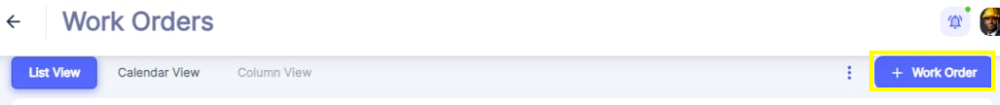
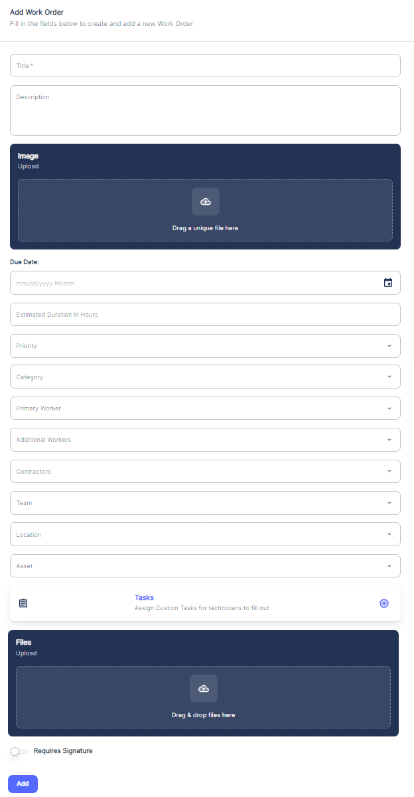

---

order: 90
---

To create a new manual work order, there are 2 Options: 

1\-click on the "\+ Work Order" button located at the top right corner of the interface.

2\-Click on desired Due date on Calendar View.

3\-Creating Work Order from Locations Menu after choosing the Location where Work Order will be executed.

All above options will open the "Add Work Order" form, where you can enter all the necessary details for the new work order:

Let's go through each field in this form:

1. __Title__: Enter a brief but descriptive title for the work order, summarizing the task or issue to be addressed.
2. __Description__: Provide a detailed description of the work to be performed, including any specific instructions, requirements, or relevant background information.
3. __Image Upload__: If applicable, you can upload images related to the work order by taking picture, dragging and dropping files or clicking the designated area to browse and select image files from your device.
4. __Due Date__: Specify the due date for completing the work order. This helps prioritize and schedule the task accordingly. In the Calendar View, Work Orders will be shown by Due Date.
5. __Estimated Duration \(hours\)__: Enter an estimate of the time required to complete the work order, which aids in resource planning and allocation.
6. __Priority__: Assign a priority level \(e.g., High, Medium, Low\) to the work order based on its urgency and importance. See Tip1  [priority assignment.](../../../tips-annexes/tip-1-priority-assignment.md)
7. __Category__: Select the appropriate category or type of work order from the provided options \(e.g., Corrective Maintenance, Inspection, Calibration, Emergency, Continuous Improvement, New Installation…\).

__🖝__ For Work Orders Categories setting refer to  [“Work Order Categories”](../../../initial-setup-and-configuration/configurations/categories-configuration.md#work-order-categories) chapter under “Categories Configuration”.

1. __Primary Worker: __

- This is the main technician responsible for executing the work order tasks and seeing it through to completion, or the one who will delegate or handover this work order to other peers
- They have the overall accountability for the work order being completed satisfactorily, whether doing the work themselves or assigning it to others
- The primary worker is the main point of contact for updates on the work order status and progress
- They coordinate with additional workers and teams as needed to ensure all tasks are finished
- Example: Assigning the most experienced HVAC technician as the primary worker on a complex air conditioning system repair work order. They assess the work required and involve other technicians for specific tasks, but remain responsible for the final outcome.__ __

1. __Additional Workers__: If required, you can assign additional workers or technicians to participate with the work order:

- These are technicians who assist the primary worker in completing the work order, often with specialized skills
- They may be assigned to handle specific subtasks within the overall maintenance job
- Additional workers support the primary worker but are not directly accountable for the entire work order
- Example: Assigning an electrician and a plumber to assist the primary HVAC technician with rewiring and drainage tasks on the air conditioning repair work order

1. __Team__: Assign the work order to a specific team or department within your organization.

- This refers to a group of maintenance staff with collective responsibility for the work order, rather than a single individual
- Teams are often used for larger, multi\-disciplinary maintenance jobs that require coordination between different technicians and trades
- The team as a whole is accountable for the successful completion of the work order, with tasks delegated among team members
- Example: Assigning a facilities maintenance team consisting of HVAC, electrical, plumbing and carpentry technicians to handle a comprehensive building maintenance work order

1. __Contractors__: If the work order involves external contractors, you can specify their details in this field. 
2. __Location__: Select the location or facility where the work needs to be performed.
3. __Asset__: If the work order is related to a specific asset or equipment, you can associate it with the work order by selecting it from the list. By Choosing the Location first, the Asset dropdown will show only Assets related to the already chosen location.
4. __Tasks/Checklists__: Optionally, you can create a checklist of tasks or tasks to be followed as part of the work order or you can choose among pre\-established checklists.\( See [Checklist Setting](../../../initial-setup-and-configuration//setting/checklist-setting.md)\).
5. __Files Upload__: Similar to the image upload section, you can attach relevant files, documents, or manuals to the work order by dragging and dropping or browsing for the files.
6. __Requires Signature__: If the work order requires a signature upon completion, you can check this box and the related Work Order will not be set Complete before the Assigned User attach the Signature.

Once you have filled in all the necessary information, click the "Add" button to create the new manual work order in the system.

By following this process, you can ensure that all critical details are captured for the work order, facilitating efficient task assignment, scheduling, and execution within the maintenance management workflow.