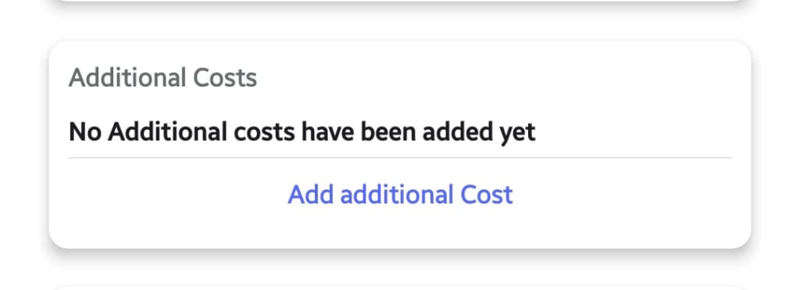
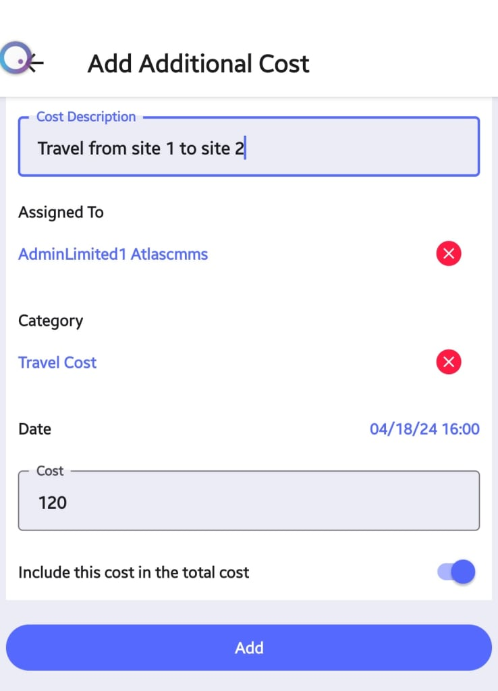
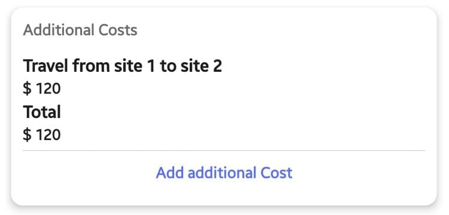

---

order: 80
---

__Definition and Purpose__

Additional costs refer to any expenses incurred during the execution of a work order that were not initially accounted for in the original cost estimate or budget. These can include materials, equipment rentals, subcontractor fees, travel expenses, permits, and more. Accurately tracking and accounting for additional costs is crucial for several reasons:

1. __Realistic Budgeting__: By capturing all costs associated with a work order, organizations can develop more accurate budgets and cost estimates for future maintenance projects.
2. __Profitability Analysis__: Additional costs directly impact the profitability of a work order. Tracking these costs allows for better analysis of job profitability and identification of areas for cost optimization.
3. __Client Billing__: If the work order is being performed for a client, all additional costs incurred must be documented and included in the final invoice for accurate billing.

__Adding Additional Costs in Atlas CMMS__

To add additional costs to a work order in Atlas CMMS:

1. __Initiate the Addition__: Within the work order form, you will see a section labeled "Additional Costs" with a button to "Add additional Cost" . Click this button to begin the process.
2. __Fill in the Details__: A new window will appear where you can input the details of the additional cost. 

Here, you will need to:

- 
	- Enter a Cost Description, such as "Travel from site 1 to site 2."
	- Assigned To: The technician, team, or individual responsible for incurring the cost, if applicable.
	- Category: The category or type of cost being added. Refer to the "[Cost Categories](../../../../initial-setup-and-configuration/configurations/categories-configuration.md#cost-categories)" chapter for a list of predefined categories in Atlas CMMS.
	- Date: The date when the additional cost was incurred.
	- Cost: The monetary amount of the additional cost.
	- Additionally, there is an important toggle switch labeled "Include this cost in the total cost." This option determines whether the additional cost should be included in the overall work order total or not.

__Use Cases for Including/Excluding Additional Costs:__

- __Include in Total__: If the additional cost is directly related to the work order and should be billed to the client or charged to the project budget, it should be included in the total cost.
- __Exclude from Total__: If the additional cost is for internal tracking purposes only, or if it will be billed separately \(e.g., travel expenses\), it can be excluded from the total work order cost.
	- The "Include in total cost" slider allows you to choose whether the additional cost should be factored into the work order's total cost. This is particularly important in scenarios such as:

Client Billing: If the additional cost is billable to the client, including it in the total cost ensures accurate invoicing.

Internal Tracking: For internal costs, such as team travel or training, you may choose not to include these in the total cost to separate them from direct work order expenses.

1. __Save the Cost__: After entering all the details, click "Add" to save the additional cost to the work order.

Once you have saved the additional cost, it will be listed under the "Additional Costs" section of the work order. Each entry will display the description and amount, providing a clear record of all additional expenses associated with the work order.

__Common Use Cases for Adding Additional Costs__

Some common use cases for adding additional costs to a work order in Atlas CMMS include:

- __Travel Expenses__: Costs incurred for technicians to travel between job sites.
- __Specialized Equipment__: Rental fees for specialized equipment needed for a task.
- __Emergency Supplies__: Purchases of emergency supplies or materials that were not anticipated.