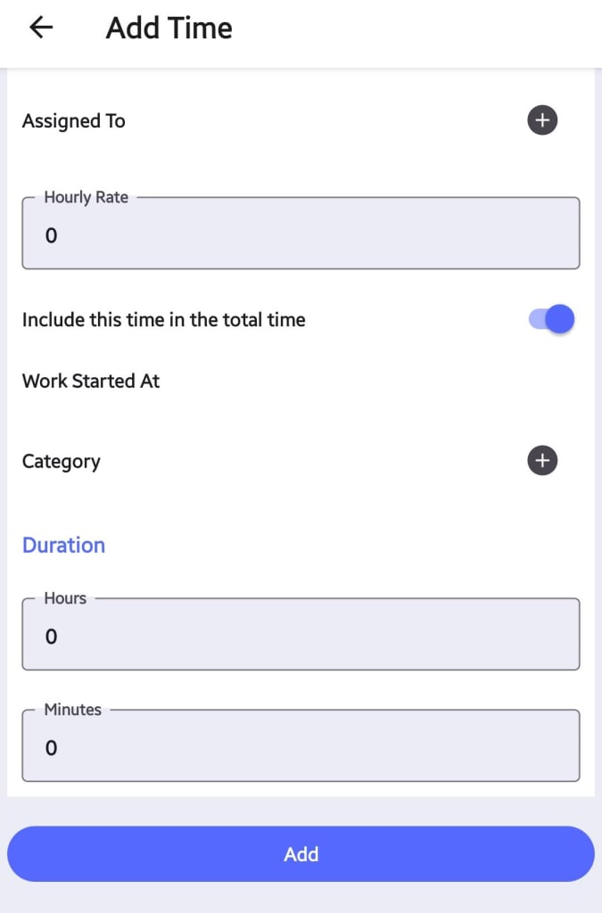

---

order: 60
---
Labor costs refer to the expenses incurred for the time and effort of technicians or workers involved in executing a work order. Accurately tracking and accounting for labor costs is crucial for several reasons:

1. __Realistic Cost Estimation__: By capturing all labor costs associated with a work order, organizations can develop more accurate cost estimates for future maintenance projects, leading to better budgeting and resource allocation.
2. __Profitability Analysis__: Labor costs directly impact the profitability of a work order. Tracking these costs allows for better analysis of job profitability and identification of areas for process optimization.
3. __Billing and Payroll__: For service providers, labor costs are directly tied to billing clients. For internal teams, they impact payroll calculations.

__Common Use Cases for Adding Labor__

Some common scenarios where labor costs may need to be added to a work order in Atlas CMMS include:

- Additional technician hours required due to unforeseen complications or scope changes
- Overtime hours worked to complete a time\-sensitive task
- Specialized labor or expertise needed for specific maintenance activities
- Travel time for technicians to reach remote job sites

__Adding Labor to a Work Order__

To add labor costs, the user would click on the "Add Time" button under the "Labors" section.

Here, the user can enter the following details:

- __Assigned To__: The technician or worker responsible for the labor hours being added.
- __Hourly Rate__: The hourly rate or cost associated with the assigned technician or worker.
- __Include this time in the total time__: This toggle switch determines whether the labor time should be included in the overall work order duration or not.
	- __Use Case for Including__: If the labor time directly contributes to the completion of the work order, it should be included in the total time to accurately reflect the overall duration.
	- __Use Case for Excluding__: If the labor time is for administrative or support tasks that do not directly contribute to the work order completion, it can be excluded from the total time.
- __Work Started At__: The date and time when the labor effort began.
- __Category__: The category or type of labor being added. Refer to the "Labor Categories" chapter for a list of predefined categories in Atlas CMMS.
- __Duration__: The total duration of the labor effort, specified in hours and minutes.

After entering all the relevant details, the user can click "Add" to save the labor cost.