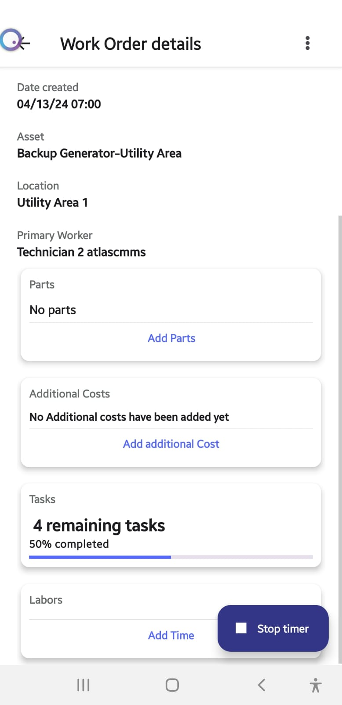
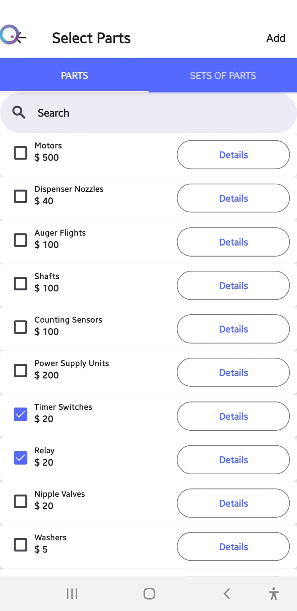
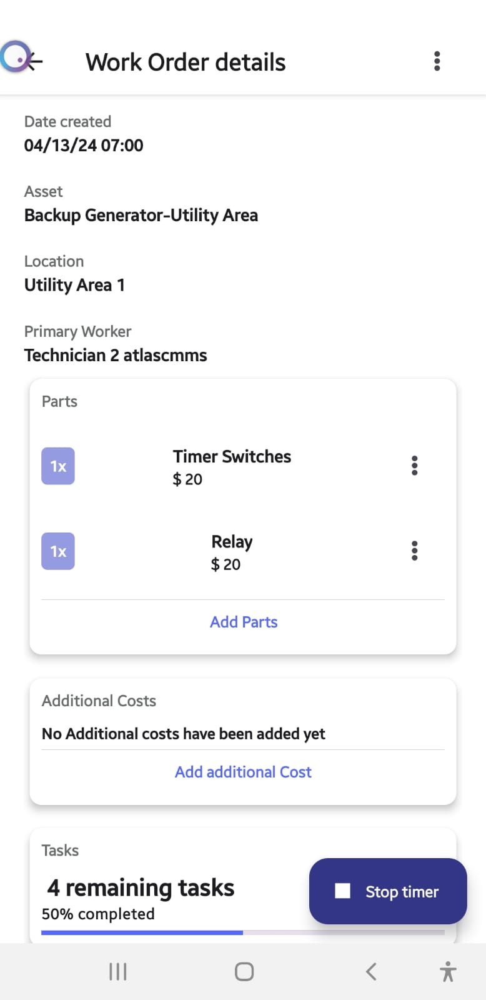
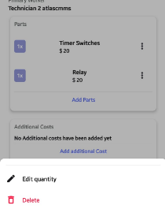
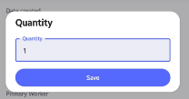

When managing a work order within Atlas CMMS, adding the necessary parts is a crucial step to ensure that all required materials are available for the task at hand. This chapter will guide you through the process of adding parts to a work order.

__ Initiating the Addition of Parts__

While progressing on a work order, you may find the need to add additional parts. To do this:

1. Click on the "Add Parts" button within the work order details page.
2. You will be presented with the parts selection interface.

__Selecting Parts__

In the parts selection interface:

1. Use the search function or scroll through the list to find the parts or sets of parts you need.
2. Once you have located the correct part, click on the "Add" button at the top right corner of the window.

__Reviewing Selected Parts__

After adding the parts:

1. You will be directed to a list showing all chosen parts, each with a default quantity of 1 .
2. To adjust the quantity of a specific part, tap on the three vertical dots to the right of the part row.

__Editing Part Quantities__

Upon tapping the three vertical dots:

1. Select "Edit Quantity" from the options that appear

1. Enter the desired quantity in the provided field and click "Save" to confirm the changes.

__Stock Availability and Notifications__

Atlas CMMS will automatically check the stock availability for the selected parts:

1. If there is sufficient stock in the system, the part will be added to the work order and the inventory will be updated accordingly.
2. If the quantity available is not sufficient, Atlas CMMS will notify you with a message stating "Quantity cannot be changed." Means that actual inventory of the Part as set in Atlas CMMS, is not enough to respond to the desired quantity.

__Managing Parts Throughout the Work Order Lifecycle__

You can continue to change parts and their quantities as long as the work order status is not set to "Complete." This allows for flexibility in managing the work order as conditions change or additional needs arise.

By following these steps, you can efficiently add and manage parts for a work order in Atlas CMMS, ensuring that all necessary materials are accounted for and reserved for the maintenance task. This process helps maintain accurate inventory levels and supports effective work order execution.