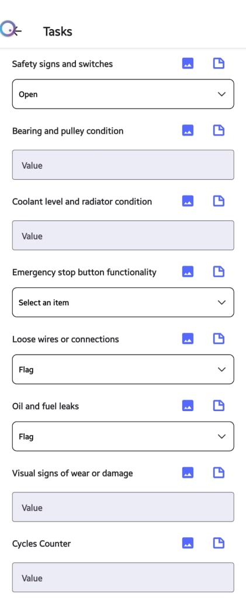

---

order: 70
---

In Atlas CMMS, filling out a maintenance checklist is a critical step in ensuring that all tasks associated with a work order are completed thoroughly and accurately. This chapter will guide you through the process of filling out a checklist and explain how the system automatically saves your inputs.

__Accessing the Checklist__

To begin filling out a checklist:

1. Navigate to the relevant work order within Atlas CMMS.
2. Locate the "Tasks" section, If the Work Order had Tasks or Checklists attached, this section will display the number of remaining tasks and your progress, as indicated by a progress bar.

Click on the "Tasks" tab to access the full list of checklist items you need to complete

__Completing Checklist Items__

Each task on the checklist may require a different type of response, such as selecting an item from a dropdown menu, entering a value, or marking a task as complete. Here's how to address each type:

1. __Dropdown Menu Tasks__: For tasks like "Safety signs and switches" or "Emergency stop button functionality," click on the dropdown menu to select the appropriate status or condition from the list of options provided.
2. __Value Input Tasks__: For tasks that require a specific measurement or value, such as "Bearing and pulley condition" or "Coolant level and radiator condition," enter the relevant data into the text field provided.
3. __Inspection Check Tasks__: For tasks that involve verification, such as "Loose wires or connections" or "Oil and fuel leaks," use the checkbox or selection icon to mark the task according to its completion status \(e.g., "Open," "In Progress," "On Hold," "Complete"\).
4. __Attachment Tasks__: If there is a need to attach documentation or images, use the download or attachment icon to upload the necessary files.

__Automatic Saving of Inputs__

As you fill out the checklist:

- The system automatically saves your inputs as soon as you make them. There is no need for an explicit save action, which streamlines the process and reduces the risk of data loss.
- You can confidently move from one task to another, knowing that your entries are securely recorded in real\-time.

__Sub\-Task Status__

Each task can also have a sub\-task status assigned to it, allowing you to indicate the current state of that particular task. This helps in tracking the progress of each item on the checklist and managing workflow more effectively.

__Leveraging the Checklist Function__

The checklist function in Atlas CMMS is designed to ensure that no step is overlooked during maintenance operations. By providing a clear and organized list of tasks with intuitive response modes and automatic saving, technicians can focus on the quality of their work without worrying about manual data entry or record\-keeping.

Upon completion of the checklist, the progress bar will reflect 100% completion, and the number of remaining tasks will update accordingly. This visual indicator provides immediate feedback on your progress and helps maintain momentum as you work through maintenance activities.

By utilizing the checklist feature in Atlas CMMS, maintenance teams can enhance their efficiency, ensure accuracy in their work, and maintain high standards of asset performance and safety.
###### Add labor information:

Labor costs refer to the expenses incurred for the time and effort of technicians or workers involved in executing a work order. Accurately tracking and accounting for labor costs is crucial for several reasons:

1. __Realistic Cost Estimation__: By capturing all labor costs associated with a work order, organizations can develop more accurate cost estimates for future maintenance projects, leading to better budgeting and resource allocation.
2. __Profitability Analysis__: Labor costs directly impact the profitability of a work order. Tracking these costs allows for better analysis of job profitability and identification of areas for process optimization.
3. __Billing and Payroll__: For service providers, labor costs are directly tied to billing clients. For internal teams, they impact payroll calculations.

__Common Use Cases for Adding Labor__

Some common scenarios where labor costs may need to be added to a work order in Atlas CMMS include:

- Additional technician hours required due to unforeseen complications or scope changes
- Overtime hours worked to complete a time\-sensitive task
- Specialized labor or expertise needed for specific maintenance activities
- Travel time for technicians to reach remote job sites

__Adding Labor to a Work Order__

To add labor costs, the user would click on the "Add Time" button under the "Labors" section.

Here, the user can enter the following details:

- __Assigned To__: The technician or worker responsible for the labor hours being added.
- __Hourly Rate__: The hourly rate or cost associated with the assigned technician or worker.
- __Include this time in the total time__: This toggle switch determines whether the labor time should be included in the overall work order duration or not.
    - __Use Case for Including__: If the labor time directly contributes to the completion of the work order, it should be included in the total time to accurately reflect the overall duration.
    - __Use Case for Excluding__: If the labor time is for administrative or support tasks that do not directly contribute to the work order completion, it can be excluded from the total time.
- __Work Started At__: The date and time when the labor effort began.
- __Category__: The category or type of labor being added. Refer to the "Labor Categories" chapter for a list of predefined categories in Atlas CMMS.
- __Duration__: The total duration of the labor effort, specified in hours and minutes.

After entering all the relevant details, the user can click "Add" to save the labor cost.
