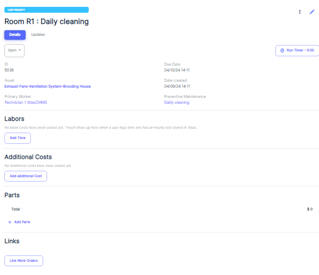
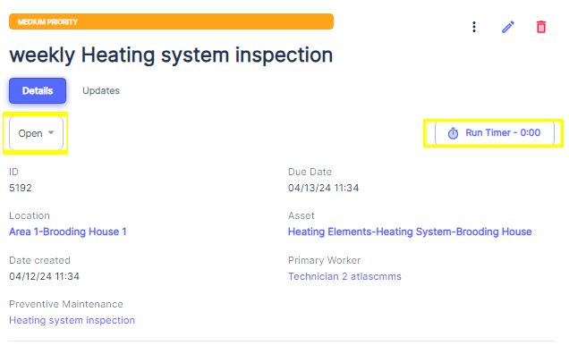
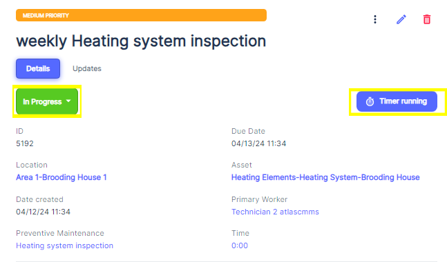
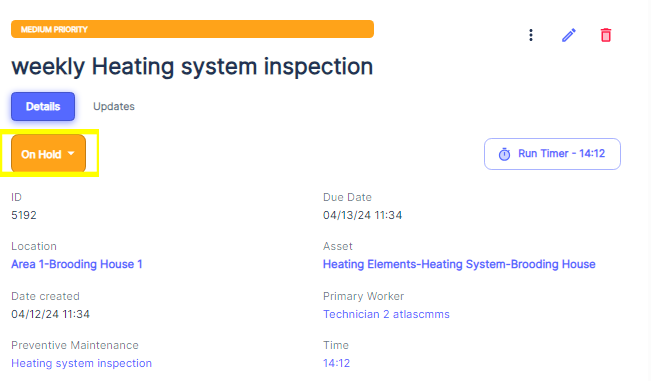

When a User receives a work order assignment notification \(by Mobile Push notifications, Web Push Notification and by e\-mail) and once the User clicks on a specific work order assigned to them, they will be presented with a detailed view of that work order:

Upon receiving the work order assignment, the User will need to take the following steps:

1. __Start the timer:__ To track the time spent on the work order, the user must start the timer, which will record the labor hours dedicated to the task. See [Using The Timer Effectively](../../../../workflows-management/work-order/managing-manual-work-orders/editing-work-orders/using-timer-effectively.md)
2. __Fill out checklists:__ If the work order includes specific checklists or task lists, the user will need to follow and complete these steps, documenting their progress along the way.
3. __Add labor information:__ As the user works on the task, they will need to record other labor hours spent. \(See [Time Categories](#_4-Timer_Categories) Chapter\).
4. __Order and add parts:__ If the work order requires the replacement or installation of parts, the technician can order the necessary parts and add them to the work order, ensuring that the required materials are available.
5. __Link related work orders:__ In some cases, a work order may be related to or dependent on another work order. The technician \(or the Admin, Limited Admin\) can link these work orders together for better tracking and coordination.For more details, see chapter about [Linked Work Orders role and use cases.](#_Linking_Work_Orders:)
6. __Update status and details:__ Throughout the process, the user should update the work order status and details to reflect the progress of the work, such as marking tasks as completed or adding notes and comments.
7. __Stop the timer and mark as complete:__ Once the work is fully completed, the user must stop the timer to accurately capture the total labor hours spent on the work order. Finally, they will mark the work order as "Complete," indicating that the task has been successfully accomplished.

By following this workflow, technicians and limited technicians can effectively manage and document their work order assignments, ensuring that maintenance tasks are carried out efficiently, accurately, and with proper tracking of labor, materials, and associated costs.

###### Using The Timer and Work Orders Status Effectively

The Timer

To track the time spent on a work order, the user shall start the __timer__ by clicking on “__Run Timer__”, which will record the labor hours dedicated to the task. 

It is recommended to use the timer to measure only the "wrench time" or the time actively spent working on the asset, as this provides an accurate representation of the added value to the work order.

Once the timer is started, the status of the work order will automatically be set to "In Progress," indicating that the maintenance task is currently underway.

While the work order is in progress, the user can pause, resume or [stop the timer](#_Stop_the_timer) as needed. This flexibility allows for accurate time tracking, even if the work is interrupted or needs to be paused for any reason. Like that, the wrench time is measured accurately.

Update Work Order status:

In Atlas CMMS, the work order status indicates the current stage of the maintenance task within its lifecycle. Proper use of statuses, along with the timer functionality, ensures accurate tracking of labor hours, downtime, and overall progress. This section will guide you through the different work order statuses and when to use them effectively.

__Work Order Statuses__

1. __Open__: When a new work order is received, it is initially set to the "Open" status. This indicates that the work order has been created and is ready to be assigned and scheduled for execution.
2. __In Progress__: Once a technician starts working on the maintenance task, the work order status should be changed to "In Progress." This status signifies that the work has begun and is currently being actively worked on.
3. __On Hold__: If the maintenance task needs to be temporarily paused due to various reasons such as waiting for parts, pending approvals, or resource constraints, the work order status can be set to "On Hold." This status indicates that the work has been interrupted and is awaiting resolution of the blocking issues before it can resume.
4. __Complete__: When the maintenance work has been finished and all tasks associated with the work order have been executed, the status should be changed to "Complete." This status marks the work order as done, signifying that no further action is required from a maintenance perspective. Refer to “[Work Order Completion](#_Work_Order_Completion)”

To Chane Work Order Status, User need to Click on Status Dropdown button and choose the appropriate status the will be reflected on Work Order General view panel.

Here are some relevant examples of when a user might need to manually change the work order status or stop the timer:

- __Parts on Backorder__: If a required part is on backorder, the user can set the work order status to "On Hold" and stop the timer until the part arrives, preventing inaccurate downtime tracking.
- __Shift Change__: When a maintenance technician's shift ends, they can stop the timer and set the status to "On Hold" and reassign to Work Order to the next shift that will resume the work order.
- __Unexpected Delays__: In case of unexpected delays, such as equipment breakdowns or safety incidents, the user can set the status to "On Hold" and stop the timer until the issue is resolved.